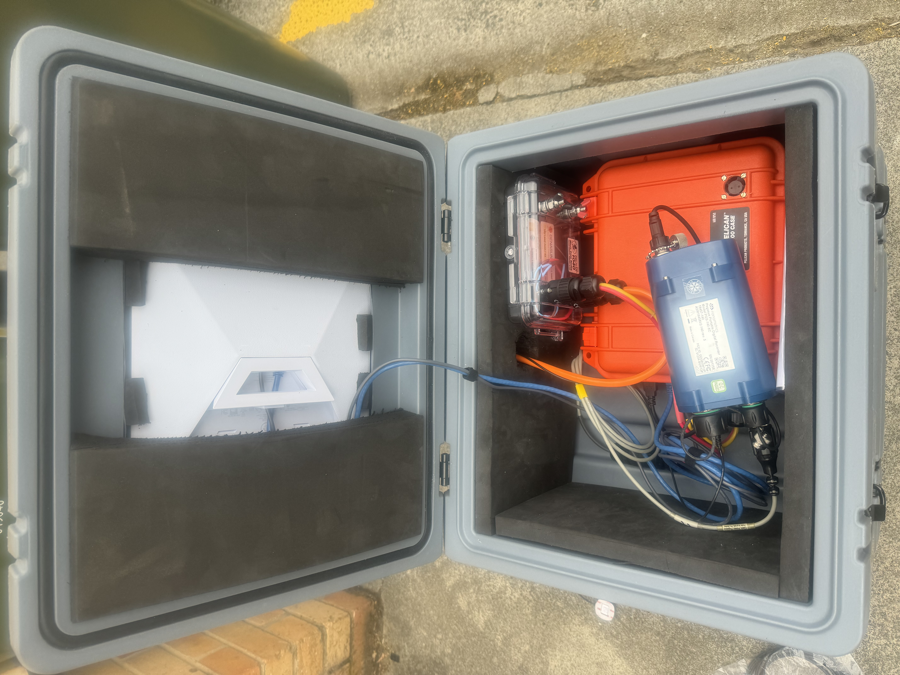
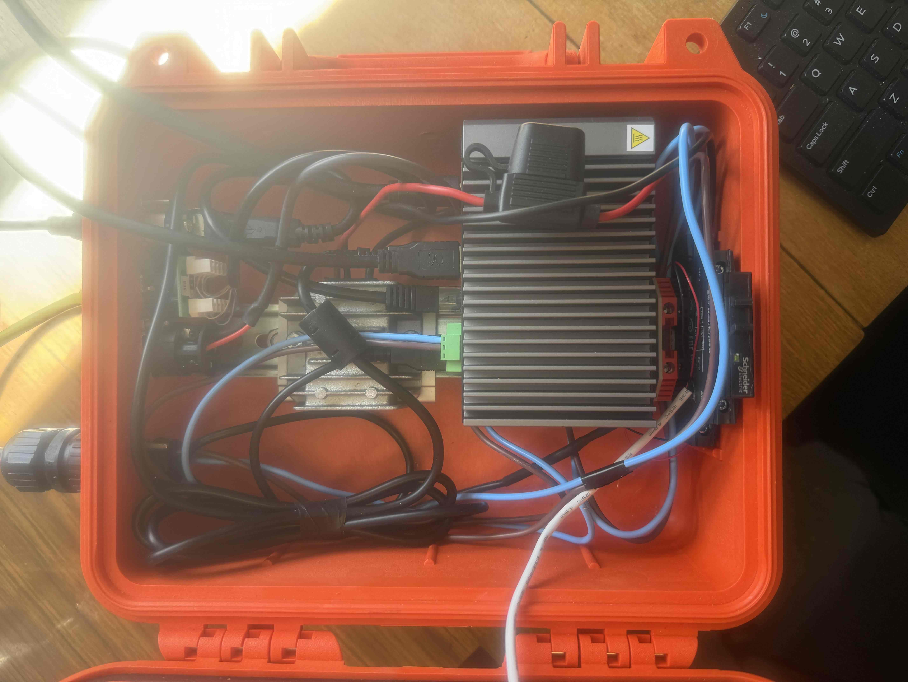
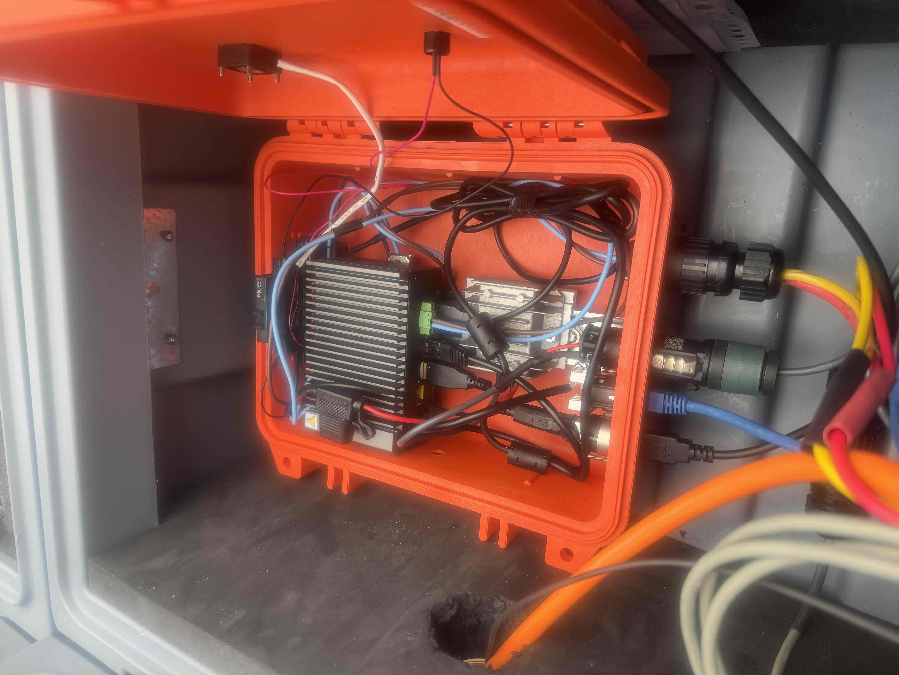
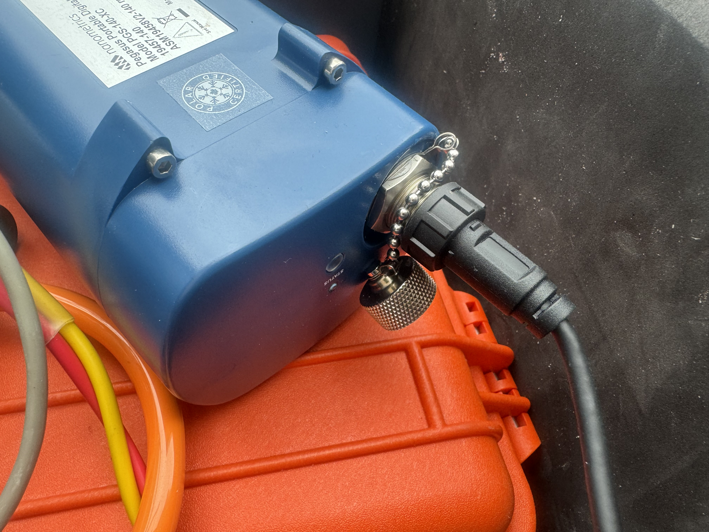

# TELE1 installation and field deployment guide

This is the comprehensive hardware, assembly, Ubuntu, software, remote-access,
testing and operating guide for TELE1. It combines Tobias Stål's original
installation notes, supplier links and photographs with the native-Harvester v4
design, rather than replacing the practical deployment information.

**Guide updated:** 27 September 2026. **Software described:** `4.0.0-alpha.1`,
code commit `171e2e5f68b2b3ac9dce7d1ef8ba404f13b9f2a6`.
The original January 2026 guide described the v3 GUI/Puppeteer installation.
That entire guide is preserved in the collapsed legacy appendix at the end.

> **Read before running commands:** v4 is a bench-test candidate, not a
> field-approved release. Its 43 local tests use synthetic Harvester output and
> local rclone transfers. Real recorder completeness, live Dropbox recovery,
> VNC, BIOS wake-up, poweroff and USB-relay behaviour still require acceptance
> testing. Installing or starting the field systemd service can shut the
> computer down, including after an error.

The main body is the current installation procedure and explains where the
implementation is still provisional. The legacy appendix is historical evidence,
not a second set of instructions to execute alongside v4.


## Contents and recommended reading order

- [Station overview and operating contract](#station-overview-and-operating-contract)
- [Hardware selection, supplier links and photographs](#hardware-selection-supplier-links-and-photographs)
- [Assembly, cabling and power checks](#assembly-cabling-and-power-checks)
- [Prepare a station inventory](#prepare-a-station-inventory)
- [Install and prepare Ubuntu](#install-and-prepare-ubuntu)
- [Configure BIOS wake-up and shutdown behaviour](#configure-bios-wake-up-and-shutdown-behaviour)
- [Install Ubuntu dependencies](#install-ubuntu-dependencies)
- [Obtain and verify Nanometrics Harvester](#obtain-and-verify-nanometrics-harvester)
- [Identify the Pegasus recorder safely](#identify-the-pegasus-recorder-safely)
- [Understand and test the native Harvester commands](#understand-and-test-the-native-harvester-commands)
- [Obtain and deploy a pinned TELE1 release](#obtain-and-deploy-a-pinned-tele1-release)
- [Configure Dropbox and rclone](#configure-dropbox-and-rclone)
- [Configure local station identity](#configure-local-station-identity)
- [Configure email and protect credentials](#configure-email-and-protect-credentials)
- [Configure remote station settings](#configure-remote-station-settings)
- [Set up Tailscale and SSH](#set-up-tailscale-and-ssh)
- [Set up the private VNC desktop](#set-up-the-private-vnc-desktop)
- [Set up Starlink diagnostics](#set-up-starlink-diagnostics)
- [Install shutdown protection without activating it](#install-shutdown-protection-without-activating-it)
- [Bench testing and field activation](#bench-testing-and-field-activation)
- [Routine operation and data recovery](#routine-operation-and-data-recovery)
- [Updates, rollback and station replication](#updates-rollback-and-station-replication)
- [Troubleshooting by symptom](#troubleshooting-by-symptom)
- [Maintenance records and future installer](#maintenance-records-and-future-installer)
- [Migration reference for existing v3 stations](#migration-reference-for-existing-v3-stations)
- [Original installation guide, preserved in full](#original-installation-guide-preserved-in-full)

For a new station, work through the sections in order on a bench with physical
access and reliable power. For an existing field station, read the migration,
power-protection and rollback sections before modifying anything.

## Station overview and operating contract

TELE1 is an unattended seismic-data collection computer connected to a
Nanometrics Pegasus recorder and Starlink. The recorder continues to be the
primary local source of seismic data; the computer wakes periodically, exports
data, uploads it to Dropbox, reports its status and powers down.

The original system was tested on Ubuntu 20.04 LTS and a Shuttle SPCEL03, and
the original January 2026 notes described successful operation in Australia
with Antarctic testing planned for 2026. The repository's September 2026
update subsequently reported that the Antarctic seismometer had transmitted
data since February 2026. This operational history does not establish that the
new v4 implementation has already been field-tested.

### Current deployment requirements

- **Wake schedule:** the computer wakes once a week through the BIOS arrangement.
  Record the actual supported RTC schedule and time convention for each computer.
- **Starlink switching:** USB 5 V from the computer controls a relay that
  switches Starlink power. Computer shutdown must therefore also switch Starlink off.
- **Data volume:** planning estimate up to approximately 50 MB per day.
  Actual export, diagnostic and retransmission volumes must be measured.
- **Recorder retention:** approximately three years of data before overwrite,
  according to the operating setup. Treat this as an estimate, not a guarantee
  that a particular old interval remains available.
- **Native exports:** waveform miniSEED, SOH, legacy SOH and logs; no routine
  raw PSF image.
- **Harvest budget:** 3,600 seconds of cumulative native export time by default,
  with a bounded termination grace period.
- **Emergency limit:** poweroff is requested at four hours from boot, including
  during a remote-maintenance session.
- **Maintenance modes:** `ssh` and `vnc` wait for a default 600 idle seconds after
  collection/reporting. Detected active connections reset the idle countdown.
  `auto` does not open a maintenance waiting window.
- **Local retention:** keep complete pending uploads and, by default, the last
  verified daily export. Small progress records and recent logs also remain.
- **Remote features:** per-station Dropbox configuration, Tailscale SSH,
  private VNC, Starlink diagnostics and a bounded email attempt per run.

At the planning rate, a week of new data is roughly 350 MB before additional
overhead. A multi-year backfill is a different workload from a routine weekly
run and may need many bounded collection cycles.

### Current data and control flow

```text
BIOS wakes computer
  -> USB 5 V energizes the Starlink control relay
  -> independent emergency timer is armed
  -> TELE1 starts and takes an exclusive lock
  -> station configuration and diagnostics
  -> retry complete pending uploads
  -> identify recorder and inspect volume ranges
  -> export required UTC days using native Harvester
  -> upload and verify Dropbox hashes
  -> acknowledge only verified intervals
  -> upload logs and attempt email
  -> optional SSH/VNC idle window
  -> systemd requests poweroff
  -> USB rail drops and Starlink relay releases
```

This last power transition must be physically tested. A software exit message
does not prove that the computer, USB port or Starlink has actually powered off.

### Software-only battery protection has a limit

There is no completely independent external power-cut timer in this installation,
and adding hardware is not currently an option. The independent systemd timer
protects against a stalled collection script while the operating system remains
functional; it cannot guarantee power removal after a complete kernel/firmware
freeze or a stuck shutdown.

The standard systemd runtime hardware watchdog reboots a machine when it is not
serviced; that is not equivalent to an independent battery-saving power cutoff
([systemd watchdog documentation](https://manpages.debian.org/bookworm/systemd/systemd-system.conf.5.en.html)).
Do not describe the four-hour deadline as a guaranteed physical power cut.

## Hardware selection, supplier links and photographs

The following equipment and supplier references preserve the original
installation notes. They document the author's tested arrangement and purchasing
references, not current stock, prices or a requirement to buy the same products.
Confirm present specifications, environmental ratings and suitability with the
supplier before ordering substitutes.

### Complete test arrangement

The original photographs show the nested enclosure arrangement, computer,
recorder, wiring and antenna mounting experiment. Keep these as visual context;
they are not a rated wiring diagram or proof of environmental certification.



Photo: Tobias Stål. Original repository photograph:
[photo_4.JPG](https://github.com/TobbeTripitaka/telemetry_setup/blob/main/img/photo_4.JPG).

### Shuttle SPCEL03 edge computer

The original guide selected the Shuttle SPCEL03 for RTC power-on support and its
overall specification/price suitability. It described an x86-64 computer with
USB and network connections, a compact field-enclosure form factor, and a tested
Ubuntu 20.04 LTS installation.

- **Original manufacturer reference:** [Shuttle SPCEL02/03 product page](https://au.shuttle.com/products/productsDetail?pn=SPCEL02/03&c=edge-pc).
- **Deployment checks:** record exact model, serial, BIOS version, installed
  storage/RAM, DC input specification and the actual wake options available.
- **USB behaviour:** select and test a USB port whose 5 V rail powers down when
  the computer shuts down. Standby-charging settings can matter.
- **Software compatibility:** successful operation on the historical OS is not
  proof that the vendor Harvester package works on the new OS target.

Do not infer the wake schedule or power connector pinout from the model family
name alone. Keep the actual computer's manual and a photograph of its relevant
BIOS settings in the station maintenance record.

### Starlink Mini connectivity

The original deployment uses Starlink Mini for internet connectivity at sites
without conventional infrastructure. The computer and dish do not need to remain
powered throughout the week when the station's data and remote-access policy
allows periodic transmission.

- **Original retail reference:** [Starlink Mini at JB Hi-Fi](https://www.jbhifi.com.au/products/starlink-mini).
- **Original power-saving note:** turn off the snow-melting feature in the
  Starlink app where appropriate for the deployment.
- **Original possible improvement:** disabling Wi-Fi may reduce consumption,
  but only do this after confirming a working wired administration/data path.
- **Site checks:** verify antenna visibility, obstruction behaviour, network
  route, service/account status and reconnect time after every power cycle.

An antenna that reconnects quickly on a warm bench may behave differently after
a week unpowered in the field. Measure cold-start readiness before choosing
network timeout and collection settings.



Photo: Tobias Stål. Original repository photograph:
[photo_1.JPG](https://github.com/TobbeTripitaka/telemetry_setup/blob/main/img/photo_1.JPG).

### Starlink DC power regulator

The original guide linked the following power product and called it a
“12V step-down” regulator. The linked product is named a Mini booster, so retain
the purchasing reference but do not assume voltage-conversion direction or
electrical suitability from that old description.

- **Original supplier reference:** [Starlink Easy 12 Volt Mini Booster](https://campervanbuilders.com.au/products/starlink-easy-12-volt-mini-booster?variant=49807162114354).
- **Alternate supplier URL:** [Mini booster page without the historical variant query](https://campervanbuilders.com.au/products/starlink-easy-12-volt-mini-booster).
- **Before connection:** check allowable input range, required output voltage,
  connector polarity, startup current, continuous current and environmental limits
  against the exact Starlink and battery arrangement.
- **Documentation:** record the regulator model, supplier datasheet, fuse choice
  and measured startup/steady-state performance in the build record.

Do not use a photographed wiring arrangement as a substitute for the product
datasheet. Have the low-voltage power design checked by someone qualified for
the equipment and deployment environment.

### Pelican case and nested enclosure

The original guide used a Pelican 1200 for the computer, relay, Starlink power
unit and associated wiring, and noted that it was more than large enough.
The author intended to build a smaller enclosure in a later version.

- **Original enclosure reference:** [Pelican 1200 case](https://www.pelican.com/ca/it/product/cases/1200?sku=1200-000-150).
- **Alternate manufacturer page:** [Pelican 1200 Protector Case](https://www.pelican.com/ca/en/product/cases/protector/1200/).
  Use this if the original localized URL does not open; the historical link
  is intentionally preserved rather than discarded.
- **Original antenna experiment:** mount the Starlink antenna inside the lid of
  the outer case, modify the foam/inner structure to hold it, and evaluate reception.
- **Original practical observation:** the author reported useful results through
  the plastic housing, while noting that cutting the holder into the lid was messy
  and deserved refinement.
- **Qualification:** those observations are specific to the prototype; verify
  performance with the actual enclosure, lid material, moisture/snow conditions,
  antenna orientation and site.

The photographs show an inner orange case within an outer grey enclosure.
Do not assume the outer case model or environmental modifications have the same
specification as the linked inner case.



Photo: Tobias Stål. Original repository photograph:
[photo_2.JPG](https://github.com/TobbeTripitaka/telemetry_setup/blob/main/img/photo_2.JPG).

### Solid-state relay and USB control

The original relay reference was selected for its specifications; the author
noted that cheaper alternatives might work equally well. Any substitute must be
checked electrically rather than chosen only by package shape or advertised current.

- **Original supplier reference:** [RS Components solid-state relay, part 9221978](https://au.rs-online.com/web/p/solid-state-relays/9221978?srsltid=AfmBOoqmeamFw7_ystevtvX469QxWLCAx3F5kNwPXLLa6v4AUEZ_Z2qg).
- **Control side:** USB 5 V is the relay-control signal in this arrangement.
  It is not a proposal to supply the Starlink load directly from a USB port.
- **Switched side:** verify DC switching suitability, load current, voltage,
  polarity, leakage, heat dissipation and the equipment's startup requirements.
- **Poweroff test:** verify relay release and Starlink shutdown after a normal
  run, an early script failure and the emergency timer.

The current Bash hardware module does not implement programmable relay commands.
The working arrangement relies on the physical presence/absence of USB power.

### Connectors, cabling and Pegasus interface

The original guide recommended CTALS as an Australian supplier of waterproof
connectors and submersible equipment. It also noted that the connector/cabling
arrangement would be improved in a future hardware version.

- **Original supplier reference:** [CTALS waterproof and submersible products](https://www.ctals.com.au/collections/waterproof-submersible-products).
- **Build checks:** record connector series and pinout, use appropriate
  strain relief, protect seals and caps, and label both ends of every cable.
- **Recorder connection:** confirm the intended Pegasus USB/data interface and
  vendor cable requirements before connecting or substituting a cable.
- **Environmental checks:** verify that gland installation, cable bends and
  connector mating preserve the intended enclosure protection.



Photo: Tobias Stål. This additional supplied photograph is retained in the
current guide as the Pegasus connector close-up; the original guide already
included the other three photographs.

### Photograph and drawing record

All four supplied JPGs and the original GRIT logo remain in `img/`; the guide
uses relative image paths so they render with the repository. The original logo
is also available through its [repository image page](https://github.com/TobbeTripitaka/telemetry_setup/blob/main/img/GRIT%20_Final.png).

Keep originals when adding annotated wiring diagrams or later build photographs.
Review image metadata before publishing new site photographs, and label which
hardware revision each photograph represents.

## Assembly, cabling and power checks

Prepare and test the hardware on a bench before sealing the enclosure. The
software cannot compensate for unstable DC power, intermittent USB connections,
incorrect pinouts, or a relay that remains on after shutdown.

### Before energizing the assembly

- [ ] Exact computer, recorder, Starlink, regulator and relay models recorded.
- [ ] Input/output voltage, polarity and cable pinouts checked against datasheets.
- [ ] Protection/fusing and cable ratings checked for the actual supply and load.
- [ ] USB used as the specified relay-control signal, not assumed to power the dish.
- [ ] Connectors fully mated; unused connectors capped.
- [ ] Cables labelled and mechanically supported.
- [ ] No exposed conductive parts can short against the enclosure or equipment.
- [ ] Condensation, ventilation/heat transfer and ingress risks reviewed.
- [ ] Recorder power remains independent where continuous recording requires it.
- [ ] A local means of recovering from a failed configuration is available.

### Power and communications acceptance

Test computer boot first, then USB/recorder visibility, then relay operation and
Starlink connectivity. Repeat tests with the assembled enclosure closed; record
measured startup times and power behaviour rather than relying only on photographs.

- **Cold start:** record the time from BIOS power-on to a usable network.
- **Data connection:** verify the same recorder identity appears after multiple boots.
- **Normal shutdown:** confirm computer power state, USB rail state and relay release.
- **Failure shutdown:** repeat after an intentionally failed collection on the bench.
- **Wake recovery:** confirm the next scheduled BIOS wake still occurs.
- **Unexpected supply loss:** test only under an approved bench procedure and
  inspect filesystem/recorder recovery afterward.

Do not cut power to the recorder as an incidental consequence of a computer-only
test unless that is explicitly part of the recorder's approved operating procedure.
The goal is to save computer/Starlink power without interrupting seismic recording.

## Prepare a station inventory

Create a private deployment record before installing secrets. Keep the non-secret
inventory with the project, and keep credentials in a separate protected store.

| Item | Record for this station |
|---|---|
| Station name | Unique `STATION_NAME`, such as `station01` |
| Location and operator | Site reference and responsible contacts |
| Computer | Model, serial, storage, RAM and supply specification |
| BIOS | Version, RTC setting, timezone convention, AC-restore setting |
| USB relay | Selected USB port and confirmed off-state voltage behaviour |
| Pegasus | Recorder identity, firmware, USB disk serial and whole-disk by-id path |
| Harvester | Package filename, version, source and trusted checksum |
| OS | Ubuntu release, architecture and installation date |
| TELE1 | Release version and exact Git commit |
| Dependencies | rclone, Tailscale, grpcurl and TigerVNC versions |
| Dropbox | Account owner, remote name, root and station prefix |
| Remote access | Tailnet, device identity, permitted users and recovery method |
| Power policy | Wake interval, harvesting budget, emergency limit |
| Data policy | Collection mode, overlap, local last-batch retention |
| Acceptance | Test results, observed poweroff and next-wake evidence |

The main guide uses `station01`, `tele1_dropbox`, `my_dropbox_path` and the
`tele` Linux account as examples. Replace these deliberately and consistently;
do not use one station's Dropbox prefix for multiple independent writers.

## Install and prepare Ubuntu

### Choose and record the operating system

The historical tested platform is Ubuntu 20.04 LTS. The requested new target is
the latest Ubuntu LTS; Ubuntu currently lists 26.04.1 LTS, but the Nanometrics
package must still be validated on that release ([Ubuntu releases](https://releases.ubuntu.com/)).

Use the x86-64/AMD64 image appropriate to the Shuttle hardware. A server or desktop
installation can host the collection service; v4 no longer requires graphical
autologin to start harvesting.

Do not combine the software migration with an untested remote OS upgrade of an
inaccessible station. Prepare and validate a separate bench computer or service
visit first, and keep the known working deployment recoverable.

On the Ubuntu station:

```bash
cat /etc/os-release
uname -m
hostnamectl
lsblk -o NAME,SIZE,TYPE,FSTYPE,LABEL,MOUNTPOINTS
df -h
```

Record the outputs without copying credentials or unrelated private files into
the public repository. Ensure free space for pending data, temporary exports,
the retained batch, logs and OS operations.

### Time and UTC

Set the system timezone to UTC and inspect synchronization. All collection-day
boundaries and example date ranges in v4 are UTC, not Hobart local time.

```bash
sudo timedatectl set-timezone UTC
timedatectl status
date -u
```

The original reference remains [Ubuntu time configuration](https://help.ubuntu.com/community/UbuntuTime).
Separately verify the RTC/BIOS clock convention; changing the displayed OS timezone
does not prove the firmware wake alarm now uses the intended time.

### Linux accounts

Use an existing administrative account to provision the station. The v4 collector
is a root-owned system service, while the `tele` account is used for permitted
remote administration and the private VNC desktop.

For a new `tele` account:

```bash
id tele
# If it does not exist:
sudo adduser --disabled-password --gecos "TELE1 Data Collection" tele
```

The old guide also added `tele` to the `sudo` group:

```bash
# Optional: only if tele is intended to be a system administrator.
sudo usermod -aG sudo tele
```

A disabled account password is not a complete sudo-access plan. Establish and test
an approved administrator authentication/recovery method rather than granting
blanket passwordless sudo to make installation convenient.

### Graphical autologin and desktop choices

The v3 guide required graphical autologin for its desktop/GUI workflow and linked
[Ubuntu's autologin instructions](https://help.ubuntu.com/stable/ubuntu-help/user-autologin.html.en).
That information is preserved, but graphical autologin is not required for the
v4 collection service and should not be enabled merely to start TELE1.

The candidate VNC arrangement supplies a separate virtual Xfce desktop. It does
not require a physical GNOME login session and is not the same as mirroring the
computer's local screen; Ubuntu 26.04's default GNOME session is Wayland-only
([Ubuntu desktop change](https://www.theregister.com/software/2026/04/24/ubuntu-resolute-raccoon-drops-xorg-keeps-x11-apps-alive/5225331)).

### Updates and installation timing

Perform normal package maintenance on the bench with sufficient power. Do not run
a full unattended OS upgrade inside the weekly data-collection script.

```bash
sudo apt update
sudo apt upgrade
```

Review prompts and reboot requirements before proceeding. Record the tested
package versions so a later dependency update can be evaluated deliberately.

## Configure BIOS wake-up and shutdown behaviour

The original Shuttle notes say to enter the BIOS with F2 during startup, enable
RTC alarm wake-up/power-on and configure the ignition-key setting if required.
Menu names and supported schedules depend on the actual firmware; consult the
[Shuttle product/manual reference](https://au.shuttle.com/products/productsDetail?pn=SPCEL02/03&c=edge-pc).

### Firmware items to record

- **RTC alarm:** supported date/day/time choices and the weekly arrangement in use.
- **RTC clock convention:** whether firmware values correspond to UTC or another
  convention, and how the OS treats the hardware clock.
- **AC power restoration:** desired behaviour after supply returns. This is a
  separate setting/behaviour from an RTC alarm.
- **Ignition-key behaviour:** whether a physical switch/input is used and how it
  interacts with shutdown and subsequent wake-up.
- **USB standby power:** which port supplies the relay and whether it remains
  powered in the selected shutdown state.
- **Firmware version:** record before changing settings or applying updates.

The old guide's wording combined RTC wake-up and restart after AC restoration.
Do not treat those as interchangeable: test both behaviours independently if
both are required by the station.

### Practical wake test

Choose a short bench interval, save the BIOS settings, shut down normally and
observe the next power-on. Repeat after testing relay release, then configure
the actual weekly schedule.

If the firmware does not expose the schedule you expect, stop and document the
limitation. Do not assume the later installer can program an unsupported BIOS
feature or invent a weekly schedule without verifying it on the computer.

Firmware updates, if needed, belong in a controlled maintenance session with the
manufacturer's recovery instructions and stable power. They are not a first
troubleshooting step on an inaccessible battery-powered station.

## Install Ubuntu dependencies

These are Ubuntu commands, not macOS commands. Run them on the bench station
using an administrative account before enabling the field service.

### Core tools

```bash
sudo apt install -y \
  bash coreutils findutils util-linux grep sed gawk \
  curl ca-certificates git jq rclone \
  openssh-server openssh-client \
  iproute2 procps usbutils file shellcheck
```

Check availability and record versions:

```bash
bash --version
rclone version
curl --version
jq --version
shellcheck --version
command -v timeout flock lsblk findmnt ss ps sha256sum
```

| Tool group | Use in the current setup |
|---|---|
| Bash and core tools | Orchestration, time arithmetic, hashes, atomic moves, bounded commands |
| util-linux / findutils | Locks, disk discovery and controlled file enumeration |
| jq | JSON metadata and diagnostics |
| rclone | Dropbox configuration, copying and content-hash verification |
| curl / CA certificates | Authenticated TLS email and approved setup downloads |
| Git | Source retrieval and exact version control |
| OpenSSH / Tailscale | Remote access and private tunnels |
| iproute2 / procps | Network/process inspection and session detection |
| usbutils | Bench USB discovery through `lsusb` |
| ShellCheck | Local static analysis before release |

The original guide listed `usb-utils`; the Ubuntu package name used here is
`usbutils`. Its Node.js, npm and Chromium dependencies belonged to the old
Puppeteer workflow and are not TELE1 v4 runtime requirements.

The original build-tool list included `build-essential`, `libssl-dev`,
`libffi-dev` and `python3-dev`. Preserve those as historical build requirements,
not mandatory v4 dependencies; install extra build tools only if a chosen
vendor/package installation actually requires them.

### rclone installation alternatives

The original guide used the [official rclone installer](https://rclone.org/install.sh)
and linked the [rclone documentation](https://rclone.org/). The Ubuntu package is
convenient for bench testing; a field release should record and use the version
that passed acceptance.

If you choose the official installer, download and review it before running it
with elevated permissions rather than blindly piping an internet response into
a root shell. Do not install or update rclone during an active collection.

The old `dropbox_uploader.sh` workflow is not part of v4. Dropbox transfer and
authorization are handled through rclone.

## Obtain and verify Nanometrics Harvester

The GitHub repository does not include the Nanometrics `.deb`, and the package's
download/distribution method has not been supplied. Obtain an approved package
from Nanometrics or your existing authorized distribution channel, and record
its version, provenance and trusted checksum.

Do not replace a real supplier checksum with one you computed yourself and then
call the download authenticated. A local hash is useful for recording an already
trusted package; authenticity still depends on its trusted source.

### Inspect and install the approved package

Substitute the actual local filename:

```bash
dpkg-deb --info /absolute/path/to/approved-pegasus-harvester.deb
sha256sum /absolute/path/to/approved-pegasus-harvester.deb
sudo apt install /absolute/path/to/approved-pegasus-harvester.deb
```

Use an absolute filename or `./filename.deb` so `apt` recognizes a local package.
Resolve package compatibility on the bench; do not guess missing libraries or
upgrade the remote OS while trying to make an unverified binary run.

### Find the native executable

The previously successful native path was:

```text
/opt/PegasusHarvester/resources/app/node_modules/@nanometrics/pegasus-harvest-lib/build/Release/harvester
```

Find the installed executable rather than assuming all package versions match:

```bash
sudo find /opt -type f -name harvester
```

Then inspect its own interface:

```bash
HARVESTER='/opt/PegasusHarvester/resources/app/node_modules/@nanometrics/pegasus-harvest-lib/build/Release/harvester'
"$HARVESTER" version -all
"$HARVESTER" help
```

The original `/opt/PegasusHarvester/pegasus-harvester` path referred to the GUI
launcher used by Puppeteer. Do not substitute the GUI launcher for the native
CLI, and do not delete the vendor's `node_modules` tree merely because TELE1's
own JavaScript helpers were removed.

The original CLI PDF is still needed as a vendor reference. The current adapter
was developed from the application's pasted `help` output and observed terminal
results, not from a newly verified copy of that PDF.

## Identify the Pegasus recorder safely

Connect the recorder on the bench, then inspect all disks before selecting an
input. Never assume a previous `/dev/sdb` designation still identifies Pegasus.

```bash
lsusb
lsblk -o NAME,SIZE,TYPE,TRAN,SERIAL,FSTYPE,LABEL,MOUNTPOINTS
ls -l /dev/disk/by-id/
findmnt /
```

### Whole disk versus FAT partition

The earlier successful test used the whole disk `/dev/sdb`, while `/dev/sdb1`
was its exposed FAT32 partition labelled `PEGASUS`. Passing the partition to
`volume-info` produced a misleading “Partition#0 is not FAT32” error; passing
the parent whole disk succeeded.

This is evidence for the tested recorder layout, not permission to hard-code
`/dev/sdb` on another boot or computer. The current station configuration requires
a whole-disk `/dev/disk/by-id/...` symlink and the expected disk serial.

### Verify the chosen stable path

Replace the placeholder with the actual whole-disk identifier, not a `-part1` link:

```bash
RECORDER_DEVICE='/dev/disk/by-id/REPLACE_WITH_WHOLE_DISK_ID'
readlink -f "$RECORDER_DEVICE"
lsblk -dn -o NAME,TYPE,TRAN,SERIAL "$RECORDER_DEVICE"
```

The block-device type must be `disk`, its serial must match the intended recorder,
and it must not be an ancestor of the system root filesystem. A shared FAT label
or a familiar-looking UUID alone is not sufficient station identity.

If the USB bridge exposes no usable serial, do not put a made-up value into
`RECORDER_SERIAL`. The current implementation deliberately requires one; resolve
and test an identity strategy before approving that hardware combination.

### Mounted FAT partition

The earlier terminal output showed the FAT partition already mounted at
`/mnt/pegasus` and `/run/media/tele2/PEGASUS`. Do not add redundant mounts or write
harvest output into a source-device mount point.

The current collector targets the verified whole block device. Follow vendor
guidance for concurrent recorder/USB access, and never run the GUI harvester and
the native collection job against the same recorder simultaneously.

## Understand and test the native Harvester commands

Use the installed binary's own help as the authority for its version. The
following reference captures the capabilities observed in the supplied help
and the commands relevant to this project.

| Command | Purpose and TELE1 use |
|---|---|
| `help` | Print supported commands and parameters |
| `version -all` | Record application and dependency versions |
| `list -safe` | Discover PSF devices; useful during bench diagnosis |
| `digitizer-info -i=... -safe` | Inspect recorder metadata |
| `volume-info -i=... -id=... -safe` | Inspect volume existence and time bounds |
| `harvest -i=... -o=... -l=... -u=... -safe` | Export native data, SOH and logs |
| `show-history -i=... -safe` | Inspect recorder harvest history; not Dropbox proof |
| `read-volume` | Advanced volume inspection; not routine station acquisition |
| `save-library` | Compact or raw PSF copy; not enabled in routine v4 collection |
| `telemetry` | Separate serial telemetry interface; not the current USB-disk workflow |

The same executable also exposes formatting, erasure, initialization,
library-loading and synthetic-data-generation commands. Do not run `format`,
`erase-volume`, `load-library`, `init-digitizer` or `generate-*` as a response to a
discovery error; they can modify recorder content and are outside this workflow.

### Inspect data categories and ranges

The observed volume IDs are:

| ID | Category |
|---|---|
| 1 | Sensor time series |
| 2 | Health time series |
| 3 | Clock status |
| 4 | Health digest |
| 5 | Operation log |
| 6 | Harvest log |
| 7 | Forensic log |

For example, after identifying the recorder:

```bash
sudo "$HARVESTER" digitizer-info "-i=$RECORDER_DEVICE" -safe
sudo "$HARVESTER" volume-info "-i=$RECORDER_DEVICE" -id=1 -safe
sudo "$HARVESTER" volume-info "-i=$RECORDER_DEVICE" -id=2 -safe
```

Inspect the other IDs during acceptance testing as well. The candidate uses the
union of available positive time bounds instead of assuming waveform bounds
also cover all SOH and logs; some volumes may not expose a time range.

The earlier test recorder lacked clock-status volume 3. The adapter permits the
specific observed missing-volume skip, but other errors must not be dismissed
just because a command eventually prints “Finished”.

### Default output layout and daily files

The supplied help shows this native output pattern:

```text
${Y}/${N}/${S}/${C}.D/${N}.${S}.${L}.${C}.D.${Y}.${J}
```

The symbols refer to year, network, station, channel, location and Julian day.
Other data types may have their own native outputs; do not invent a new directory
hierarchy for them.

TELE1 deliberately does not pass `-p`. It passes `-d=24` to request daily
waveform files, because the supplied CLI help listed a one-hour default even
though the native pattern contains a day number.

### Safe bench export

Choose a full UTC day that actually has data according to `volume-info`.
The dates below are illustrative; change them for the connected recorder and
use a fresh local test directory, never the recorder mount or production Dropbox.

```bash
START_UTC='2025-06-01 00:00:00 UTC'
END_UTC='2025-06-02 00:00:00 UTC'
START_SEC=$(date -u -d "$START_UTC" +%s)
END_SEC=$(date -u -d "$END_UTC" +%s)
LOWER_NS=$((START_SEC * 1000000000))
UPPER_NS=$((END_SEC * 1000000000 - 1))
BENCH_OUT="$HOME/pegasus-bench-$(date -u +%Y%m%dT%H%M%SZ)"
mkdir -p "$BENCH_OUT"
df -h "$BENCH_OUT"
```

When the input identity, dates and free space have been checked:

```bash
sudo "$HARVESTER" harvest \
  "-i=$RECORDER_DEVICE" "-o=$BENCH_OUT" \
  "-l=$LOWER_NS" "-u=$UPPER_NS" \
  -d=24 -safe \
  -harvestData=1 -harvestSoh=1 -harvestLegacySoh=1 -harvestLogs=1
```

`-safe` means the application's safe device-I/O mode, not a guarantee of
read-only recorder access. Observed output includes a harvest-history update;
do not call this command an operation that cannot write anything to the recorder.

Inspect the result:

```bash
sudo find "$BENCH_OUT" -type f -printf '%P  %s bytes\n' | head -50
sudo du -sh "$BENCH_OUT"
sudo find "$BENCH_OUT" -type f | wc -l
```

The output may be root-owned because the native command ran through sudo.
Verify waveform samples, channels, timestamps and gaps with an independent
miniSEED reader and a vendor/reference export; a nonzero file count is not
scientific completeness verification.

### Boundary, overlap and repeated-path checks

Export two adjacent full days separately and together, then compare file lists
and sample coverage. Test midnight boundaries, records that straddle midnight,
time correction, the latest partial day and missing-data intervals.

The candidate rejects a native filename reused by different daily batches rather
than overwriting a potentially fuller earlier file. If SOH/log naming causes
this guard to trigger, stop and resolve the output contract; do not remove the
guard just to make an upload proceed.

Partial-hour bench files must not be copied over canonical full-day files in
production Dropbox. Keep all experiments in a separate local directory and,
if cloud testing is needed, a separate test station prefix.

### PSF images and harvest history

A raw PSF image can preserve the recorder layout but may be a very large single
file. The current requirement explicitly excludes that routine upload, and
`save-library` is not called by the collector.

Similarly, recorder harvest history is not the upload checkpoint. “Since last”
in v4 means previously verified Dropbox coverage, not merely a GUI button or a
record that someone read the recorder.

## Obtain and deploy a pinned TELE1 release

### Clone on the bench machine

Use the public repository URL from the original guide. Its directory is named
`telemetry_setup`, not `tele1`, unless you explicitly choose another clone name.

```bash
mkdir -p "$HOME/projects"
cd "$HOME/projects"
git clone https://github.com/TobbeTripitaka/telemetry_setup.git
cd telemetry_setup
git status --short
```

For reproducible testing of the current candidate, select its exact code commit:

```bash
TELE1_COMMIT=171e2e5f68b2b3ac9dce7d1ef8ba404f13b9f2a6
git checkout --detach "$TELE1_COMMIT"
git rev-parse HEAD
cat VERSION
```

That commit contains the software candidate; newer documentation-only commits
may expand this guide without changing the runtime. Record both the tested code
commit and the guide revision used during installation.

Do not automatically `git pull` a moving `main` branch on each weekly wake.
Test a specific version first and deploy it deliberately.

### Run tests before installation

These tests do not connect to a recorder, Dropbox or SMTP and do not power off
the computer. They require the local Ubuntu tools installed earlier.

```bash
bash tests/run.sh
shellcheck -S warning -e SC2034 \
  tele1.sh lib/common.sh lib/config.sh lib/hardware.sh \
  lib/harvest.sh lib/upload.sh lib/notification.sh lib/remote.sh \
  scripts/*.sh tests/*.sh
```

SC2034 is excluded for intentional shared globals between sourced modules.
The published candidate passed 43 tests locally; real hardware acceptance is
still a separate obligation.

### Intended runtime layout

```text
/opt/tele1/
  releases/<version-and-commit>/
    tele1.sh
    VERSION
    lib/
    scripts/
    systemd/
    config/
    docs/
  current -> releases/<version-and-commit>
/etc/tele1/
  node.conf
  credentials.txt
  rclone.conf
  vnc/tele.passwd
  FIELD_ENABLED                 # absent until explicit field activation
/var/lib/tele1/<station_name>/
  pending/
  verified/
  owners/
  last-verified/
  config.txt                    # last validated remote settings
  recorder-id
/var/log/tele1/<station_name>/
```

Code, runtime state and credentials are separate. Updating or rolling back code
must not delete pending exports or roll back the upload acknowledgments.

### Manual release placement

This is for a new bench installation. Do not overwrite an existing immutable
release directory; if the chosen path already exists, inspect it and select an
appropriate new release path.

```bash
RELEASE_DIR='/opt/tele1/releases/4.0.0-alpha.1-171e2e5'
sudo install -d -m 0755 /opt/tele1/releases
sudo mkdir "$RELEASE_DIR"
```

From the checked-out repository, after confirming the directory is new:

```bash
set -o pipefail
git archive "$TELE1_COMMIT" \
  tele1.sh VERSION lib scripts systemd config docs tests \
  README.md INSTALLATION.md img |
  sudo tar -x -C "$RELEASE_DIR"
sudo chown -R root:root "$RELEASE_DIR"
sudo chmod 0755 "$RELEASE_DIR/tele1.sh" "$RELEASE_DIR/scripts/vnc-desktop.sh"
```

No credentials or live data should be in the source checkout. The selected
archive paths also avoid deploying the repository's historical runtime logs.

For a new installation only, create the current link:

```bash
sudo ln -s "$RELEASE_DIR" /opt/tele1/current
readlink -f /opt/tele1/current
```

If `/opt/tele1/current` already exists, use the later update/rollback procedure
instead of blindly replacing it during a running collection.

### Create configuration directories

Keep private files mode 0600 and root-owned. The top-level directory allows
traversal so the separately protected VNC subdirectory can be accessed by `tele`.

```bash
sudo install -d -o root -g root -m 0755 /etc/tele1
sudo install -d -o root -g root -m 0700 /var/lib/tele1 /var/log/tele1
```

Do not create `FIELD_ENABLED` yet. Do not start or enable the collector until
the identity, authentication, data and power tests have been completed.

## Configure Dropbox and rclone

Create or select the station's Dropbox account through [Dropbox](https://www.dropbox.com).
The original guide suggested using the station's Gmail address for the account;
that remains an organizational choice, not a technical requirement.

Rclone uses Dropbox OAuth authorization, not a Dropbox account password in
TELE1's email file. Its configuration contains sensitive token material and must
remain private ([rclone Dropbox documentation](https://rclone.org/dropbox/)).

### Choose the remote and destination

The guide uses these example values:

```text
RCLONE_REMOTE=tele1_dropbox
DROPBOX_ROOT=my_dropbox_path
STATION_NAME=station01
```

The resulting Dropbox layout is:

```text
my_dropbox_path/
  tele/
    station01/
      config.txt
      pegasus_harvester/
        <native Harvester paths, unchanged>
      tele_logfiles/
        <run logs and diagnostics>
        harvest/
        receipts/<recorder_serial>/
      <future_extension>/
    station02/
      config.txt
      pegasus_harvester/
      tele_logfiles/
```

An empty `DROPBOX_ROOT` places `tele/` at the remote root. `DROPBOX_ROOT` must
not include the remote name or append another `/tele/<station_name>` itself.
Use distinct station names and prefixes for distinct computers.

### Use an explicit service configuration file

Provision the rclone configuration that the root service will actually use:

```bash
sudo rclone --config /etc/tele1/rclone.conf config
```

In the wizard:

1. Create a new remote.
2. Name it `tele1_dropbox`, or your deliberately chosen `RCLONE_REMOTE`.
3. Choose backend `dropbox` by name; numeric menu positions change.
4. Normally leave client ID/secret blank unless using your own approved Dropbox app.
5. Select browser or headless authorization as appropriate.
6. Complete authorization and confirm the remote.
7. Quit the wizard and protect the file.

```bash
sudo chown root:root /etc/tele1/rclone.conf
sudo chmod 0600 /etc/tele1/rclone.conf
sudo stat -c '%a %U %G %n' /etc/tele1/rclone.conf
sudo rclone --config /etc/tele1/rclone.conf listremotes
```

The historical default location `~/.config/rclone/rclone.conf` remains relevant
for interactive user installations, but v4 uses the explicit path from
`node.conf`. Configuring a remote as your desktop user does not automatically
configure the root-run service.

### Browser authorization on the Ubuntu bench machine

If the bench machine has a browser, choose the browser authorization flow.
If rclone cannot launch a browser from sudo, open the local URL it actually prints
in the normal user's browser on that same machine.

The old guide showed a sample URL such as
`http://127.0.0.1:53682/auth?state=xxxxxxxx`; that is only an example.
Use the newly generated URL, complete the Dropbox authorization and return to
the wizard ([rclone headless/browser setup](https://rclone.org/remote_setup/)).

### Headless authorization using a Mac

Choose the headless option on the Ubuntu station. Run the exact `rclone authorize`
command printed by its wizard on a browser-equipped computer, then transfer the
returned token directly into the Ubuntu wizard; matching rclone versions are
recommended ([rclone remote setup](https://rclone.org/remote_setup/)).

For a standard Dropbox remote the command will typically resemble:

```bash
# On the Mac, after installing rclone there:
rclone authorize dropbox
```

If the wizard prints additional encoded parameters for a custom app, use its
exact command instead. Treat the resulting JSON/token as a password: do not
paste it into GitHub issues, logs, this guide, email or an assistant conversation.

An alternative is to create the remote in a dedicated configuration file on the
Mac and securely transfer that file to `/etc/tele1/rclone.conf`, then set its
owner and permissions. Do not copy a general-purpose configuration containing
unrelated cloud credentials onto the field station
([rclone configuration transfer](https://rclone.org/remote_setup/)).

### Non-destructive connectivity check

Use a separate test prefix while validating the candidate:

```bash
REMOTE_BASE='tele1_dropbox:my_dropbox_path/tele/station01-test'
sudo rclone --config /etc/tele1/rclone.conf mkdir "$REMOTE_BASE"
sudo rclone --config /etc/tele1/rclone.conf lsf "$REMOTE_BASE"
```

An empty listing can be valid for an empty folder. Authentication or permission
errors are not equivalent to “there are no files”.

### Small upload and hash verification test

This command block intentionally writes a small test file to the chosen test
prefix. Confirm the value of `REMOTE_BASE` first; do not point it at another
station or an unrelated Dropbox folder.

```bash
TEST_DIR=$(mktemp -d)
mkdir "$TEST_DIR/data"
printf 'TELE1 bench upload test\n' >"$TEST_DIR/data/rclone-test.txt"
sudo rclone --config /etc/tele1/rclone.conf copy \
  "$TEST_DIR/data" "$REMOTE_BASE/setup-test" --checksum --dropbox-batch-mode sync
sudo rclone --config /etc/tele1/rclone.conf hashsum Dropbox \
  "$TEST_DIR/data" --output-file "$TEST_DIR/dropbox.sum"
sudo rclone --config /etc/tele1/rclone.conf check \
  "$TEST_DIR/dropbox.sum" "$REMOTE_BASE/setup-test" \
  --checkfile Dropbox --one-way
```

The Dropbox backend supports its content hash and synchronous upload completion;
the collector relies on these rather than a filename or size alone
([rclone Dropbox integrity behaviour](https://rclone.org/dropbox/)).
One-way checking leaves unrelated destination files alone
([rclone check](https://rclone.org/commands/rclone_check/)).

After verifying the exact test destination, you may remove only the test file:

```bash
sudo rclone --config /etc/tele1/rclone.conf deletefile \
  "$REMOTE_BASE/setup-test/rclone-test.txt"
rm -f "$TEST_DIR/data/rclone-test.txt" "$TEST_DIR/dropbox.sum"
rmdir "$TEST_DIR/data" "$TEST_DIR"
```

Do not replace that targeted deletion with a recursive purge of the station
prefix. The production collector itself does not delete Dropbox data.

## Configure local station identity

For a new installation, copy the example and edit it locally:

```bash
sudo install -o root -g root -m 0600 \
  /opt/tele1/current/config/node.conf.example /etc/tele1/node.conf
sudoedit /etc/tele1/node.conf
```

Do not repeat the copy step over an already configured file. The finished file
contains literal settings like these, with real non-secret identity values:

```ini
STATION_NAME=station01
RCLONE_REMOTE=tele1_dropbox
DROPBOX_ROOT=my_dropbox_path
RECORDER_SERIAL=REPLACE_WITH_LSBLK_SERIAL
RECORDER_DEVICE=/dev/disk/by-id/REPLACE_WITH_WHOLE_DISK_ID
RCLONE_CONFIG=/etc/tele1/rclone.conf
PEGASUS_BIN=/opt/PegasusHarvester/resources/app/node_modules/@nanometrics/pegasus-harvest-lib/build/Release/harvester
VNC_SERVICE=tele1-vnc@tele.service
VNC_PORT=5901
```

| Setting | Meaning and constraints |
|---|---|
| `STATION_NAME` | Unique identifier; letters, numbers, dots, underscores and hyphens, beginning with a letter/number |
| `RCLONE_REMOTE` | Configured remote name without its trailing colon |
| `DROPBOX_ROOT` | Optional root prefix; current parser permits letters, numbers, underscores, dots, slashes and hyphens, not spaces |
| `RECORDER_SERIAL` | Exact trimmed serial exposed by `lsblk`; current parser has the same identifier character restriction |
| `RECORDER_DEVICE` | Absolute whole-disk `/dev/disk/by-id/...` link, not a partition link |
| `RCLONE_CONFIG` | Absolute protected rclone configuration path |
| `PEGASUS_BIN` | Absolute native executable path |
| `VNC_SERVICE` | Matching `tele1-vnc@<user>.service` instance |
| `VNC_PORT` | Session-detection port; keep 5901 with the supplied `:1` VNC service |

Changing `VNC_PORT` alone does not reconfigure TigerVNC's listening port. Change
the service and detection configuration together, then retest.

The collector records the recorder serial in local state and refuses an
unexpected replacement. Do not delete that identity check to make a different
recorder look like the old one; plan an explicit migration or use a new station
identity/prefix when appropriate.

Local identity and executable/device paths are not accepted from Dropbox
`config.txt`. This keeps remotely downloaded settings from selecting an arbitrary
program or disk.

## Configure email and protect credentials

### Gmail app-password setup

The current notification implementation uses Gmail's SMTP service with an app
password. Enable 2-Step Verification and follow Google's account-specific
app-password instructions; managed accounts, security-key-only configurations
and Advanced Protection can affect availability
([Google app-password help](https://support.google.com/accounts/answer/185833?hl=en)).

The original account-management reference is [Google Account](https://myaccount.google.com).
Create an app password for this station rather than using the account's normal
sign-in password, and keep recovery access under the operator's control.

### Create the private email file

For a new installation:

```bash
sudo install -o root -g root -m 0600 \
  /opt/tele1/current/config/credentials.txt.example /etc/tele1/credentials.txt
sudoedit /etc/tele1/credentials.txt
```

The current file accepts only these three keys:

```ini
EMAIL_FROM=station-account@gmail.com
EMAIL_TO=operator@example.com
EMAIL_PASSWORD=REPLACE_WITH_STATION_APP_PASSWORD
```

The current candidate accepts one recipient address. Multiple-recipient syntax,
arbitrary SMTP providers and the legacy `EMAIL_TIMEOUT` setting are not implemented
by this parser; do not add unsupported keys and assume they will be ignored.

Use full-line comments if necessary, not an inline comment after a password.
The parser is literal data parsing: it does not expand variables, execute shell
commands or interpret a sourced credentials script.

### Inspect permissions without exposing secrets

```bash
sudo stat -c '%a %U %G %n' \
  /etc/tele1/node.conf \
  /etc/tele1/credentials.txt \
  /etc/tele1/rclone.conf
```

Expect root ownership and mode 600 for these files. Do not print their contents
into a shared terminal recording, log, support message or Git commit.

The original guide's `source credentials.txt` and password-in-argument email
examples are preserved only in the historical appendix. The new code keeps the
SMTP password in a temporary private curl configuration instead of command arguments.

### Send a bench email without starting field collection

The following runs only the notification helper from the installed, trusted
code. It sends a real message to `EMAIL_TO`, creates local diagnostic/state
directories, and does not invoke the recorder or install a shutdown trap.

```bash
sudo bash <<'BASH'
set -Eeuo pipefail
source /opt/tele1/current/tele1.sh
load_node_config /etc/tele1/node.conf
init_workspace
runtime_defaults
load_credentials /etc/tele1/credentials.txt
log "Explicit bench email test"
send_notification BENCH_TEST
BASH
```

Confirm the message arrived and inspect the station's local log if it did not.
Email is best effort: unavailable internet, invalid credentials or emergency
shutdown can prevent delivery even though power protection works correctly.

### Credential lifecycle

- **Separate credentials:** use station-specific access where practical and
  document who can revoke or replace it.
- **Dropbox:** keep refresh-token configuration private and writable only by the
  service identity so rclone can maintain authorized access.
- **Tailscale:** distinguish an enrollment auth key from the enrolled device's
  identity and access policy.
- **VNC:** use a separate VNC credential; never email it automatically.
- **Git:** commit examples, not actual private files or logs containing tokens.
- **Incident response:** revoke exposed material at the provider, replace it on
  the station through a trusted channel, and verify recovery before deployment.

The planned single-input installer may split one private provisioning file into
these runtime files. It does not exist yet, and a list of email/password pairs
alone cannot substitute for Dropbox OAuth authorization.

## Configure remote station settings

Each computer reads its own Dropbox configuration:

```text
<dropbox_root>/tele/<station_name>/config.txt
```

The candidate validates a downloaded file before replacing its cache. If download
or validation fails, it uses the last validated local copy or safe built-in
defaults; it does not execute the file as shell code.

### Format rules

- **Syntax:** one literal `KEY=value` per line.
- **Comments:** blank lines and full lines beginning with `#` are allowed.
- **Quotes:** simple outer single/double quotes are accepted literally; shell
  substitutions and escapes are not evaluated.
- **Keys:** duplicate and unknown keys are rejected, not silently accepted.
- **Size:** the current parser limits a file to 32 KiB.
- **Dates:** whole UTC dates in `YYYY-MM-DD` format for range mode.
- **Units:** all current timeout settings below are integer seconds, not hours.

### Supported settings

| Key | Default | Accepted values / effect |
|---|---|---|
| `EXECUTE` | `auto` | `auto`, `ssh`, `vnc` |
| `HARVEST_MODE` | `incremental` | `incremental`, `reconcile`, `reupload`, `range` |
| `REQUEST_ID` | Empty | Required for non-incremental modes; 1–80 letters, numbers, dots, underscores or hyphens |
| `FROM_DATE` | Empty | Valid `20xx-MM-DD`, required for `range` |
| `TO_DATE` | Empty | Valid later UTC date, exclusive upper day boundary for `range` |
| `MAINTENANCE_IDLE_SECONDS` | `600` | Integer 0–3600; used only in SSH/VNC modes |
| `HARVEST_BUDGET_SECONDS` | `3600` | Integer 1–3600; cumulative native export budget |
| `NETWORK_TIMEOUT_SECONDS` | `300` | Integer 10–600; bound for each rclone operation |
| `RETAIN_LAST_BATCH` | `yes` | `yes` or `no`; pending completed uploads remain in either case |
| `MIN_FREE_MIB` | `2048` | Integer 256–1048576; free-space reserve threshold |
| `OVERLAP_DAYS` | `2` | Integer 1–30; revisit recent days as well as unverified/open days |

The four-hour emergency ceiling is deliberately a local administrator-controlled
systemd setting, not a way for downloaded config to disable battery protection.
The initial config download also starts with the built-in network bound.

### Normal weekly collection

```ini
EXECUTE=auto
HARVEST_MODE=incremental
HARVEST_BUDGET_SECONDS=3600
RETAIN_LAST_BATCH=yes
```

This is the power-saving unattended mode. It does not wait for SSH/VNC after
the work and reporting stages, so request a maintenance mode before the next
wake when remote access is needed.

### SSH maintenance window

```ini
EXECUTE=ssh
HARVEST_MODE=incremental
MAINTENANCE_IDLE_SECONDS=600
RETAIN_LAST_BATCH=yes
```

The normal idle countdown begins after the other stages finish. Detected sessions
keep resetting it; after the last detected connection ends, a fresh idle interval
must elapse before normal shutdown.

The emergency timer still applies. A disconnected-but-stale transport may be
counted conservatively as active, which is why session detection is not a
replacement for the boot-time deadline.

### VNC maintenance window

```ini
EXECUTE=vnc
HARVEST_MODE=incremental
MAINTENANCE_IDLE_SECONDS=600
```

This requests the separately provisioned private VNC service after collection
and reporting, then uses the same idle-window logic. If VNC fails to start,
the current code logs that failure and preserves the SSH waiting window.

### Reconcile all retained data

```ini
EXECUTE=auto
HARVEST_MODE=reconcile
REQUEST_ID=full-check-2026-09
RETAIN_LAST_BATCH=yes
```

`reconcile` re-exports the recorder's retained history and uploads missing or
changed contents, not files that already match. Keep the same request ID to
resume a long scan over multiple wakes; use a new ID to request another full scan.

### Force reupload

```ini
EXECUTE=auto
HARVEST_MODE=reupload
REQUEST_ID=force-send-2026-09
```

`reupload` deliberately retransmits each newly processed day for that request.
Days already acknowledged for the same request are not repeatedly forced from
the start every week; recent overlap processing also avoids indefinitely forcing
the same acknowledged contents.

### Repair a date range

```ini
EXECUTE=auto
HARVEST_MODE=range
REQUEST_ID=repair-june-october-2025
FROM_DATE=2025-06-01
TO_DATE=2025-11-01
```

This requests June through October as full UTC days, ending before 1 November.
Full-day exports protect the canonical native daily files from accidental
replacement with a shorter hour-only export.

### Upload the configuration

Prepare a file locally, check the station destination, then upload that exact
file. This example deliberately uses the test station prefix until acceptance.

```bash
REMOTE_BASE='tele1_dropbox:my_dropbox_path/tele/station01-test'
sudo rclone --config /etc/tele1/rclone.conf copyto \
  /absolute/path/to/config.txt "$REMOTE_BASE/config.txt" --checksum
sudo rclone --config /etc/tele1/rclone.conf cat "$REMOTE_BASE/config.txt"
```

It is safe to inspect this non-secret runtime configuration, but do not put email
passwords, Dropbox tokens, Tailscale auth keys, executable paths or device paths
in it. Editing it affects a subsequent validated load, not necessarily a
collection that has already read its configuration.

## Set up Tailscale and SSH

The original project uses Tailscale to reach a station behind Starlink without
opening public inbound ports. Preserve the original [Tailscale overview link](https://tailscale.com/blog/free-plan)
and [admin console](https://login.tailscale.com), but check the current service
terms rather than treating an old plan description as a deployment entitlement.

### Ubuntu installation and enrollment

Use Tailscale's current Ubuntu instructions or its stable package repository.
The documented convenience installer remains available, but a reproducible field
build should record the installed version ([Tailscale Linux installation](https://tailscale.com/docs/install/linux)).

The original one-line installer was:

```bash
curl -fsSL https://tailscale.com/install.sh | sh
```

For a controlled build, download/review the script or follow the provider's
package-repository method before granting installation privileges. After
installation, enroll interactively on the bench:

```bash
sudo tailscale up
tailscale status
tailscale ip
```

Follow the actual authorization URL locally and confirm the correct tailnet and
device identity. Do not paste reusable enrollment keys into public setup logs.

### Choose the SSH path deliberately

There are two related but different ways to use SSH:

- **OpenSSH over Tailscale:** the operating system's `sshd` handles authentication,
  while the tailnet provides network connectivity.
- **Built-in Tailscale SSH:** Tailscale intercepts port 22 on the device's
  Tailscale address and authorizes access through tailnet SSH policy, rather than
  the normal OpenSSH server ([Tailscale SSH](https://tailscale.com/docs/features/tailscale-ssh)).

To enable the built-in option from a local bench session:

```bash
sudo tailscale set --ssh
```

Enabling it can interrupt an existing SSH connection to the Tailscale address;
maintain local recovery access while making the change
([Tailscale SSH setup](https://tailscale.com/docs/features/tailscale-ssh)).
Allow both the required network access and the intended SSH users in tailnet policy.

For ordinary OpenSSH, verify its service on the bench:

```bash
sudo systemctl enable --now ssh
sudo systemctl status ssh
```

Do not expose SSH/VNC to the public internet or add router forwarding merely
because a historical example displayed a public IP. Restrict access to the
intended administrative network and test the selected authentication path.

### Enrollment key expiry versus device access

An auth key used to enroll a device and the enrolled device's later key-expiry
policy are different operational concerns. Decide how the station will maintain
authorized access through long unattended intervals before deployment.

Tailscale documents disabling device key expiry for trusted continuously
connected devices, while warning that this reduces security and requires prompt
revocation if the device is lost or compromised
([Tailscale Linux key-expiry guidance](https://tailscale.com/docs/install/linux)).
Apply an explicit policy to each station rather than assuming a one-time login
will remain usable indefinitely.

### macOS administration computer

The simplest current client choice is the standalone macOS app recommended by
Tailscale; sign into the same intended tailnet
([Tailscale macOS installation](https://tailscale.com/docs/install/mac)).
Do not run multiple conflicting Tailscale app/daemon variants on the Mac
([macOS variant guidance](https://tailscale.com/docs/concepts/macos-variants)).

The original Homebrew CLI-only method is retained for administrators who choose
that variant deliberately:

```bash
brew install --formula tailscale
sudo brew services start tailscale
sudo tailscale up
tailscale status
```

Those commands correspond to the open-source daemon variant, not an instruction
to add a second daemon alongside the standalone app
([Tailscale's macOS CLI instructions](https://github.com/tailscale/tailscale/wiki/Tailscaled-on-macOS)).
The Mac only needs client connectivity to administer the Ubuntu station.

### Connect and disconnect

Use the station's actual Tailscale address or approved MagicDNS hostname:

```bash
ssh tele@station01
```

The original guide used `tele@100.116.108.33` and `tele@tele1-node` as examples.
They are preserved as historical examples, not assumed to identify your new node.

End the session normally:

```bash
exit
```

In `ssh`/`vnc` mode, normal shutdown is deferred while the candidate detects an
active session, but the emergency deadline still wins. Test interactive shells,
file transfers, tunnels and abrupt disconnects with the installed versions.

### Retrieve protected logs

V4 state/log files are normally root-owned and private. Do not change their
permissions recursively to 777 just to make SCP work.

An authorized administrator can export a selected non-secret diagnostic file
to a temporary operator-readable location, then copy it from the Mac. For example,
replace the actual run filename before using this Ubuntu command:

```bash
sudo install -o tele -g tele -m 0600 \
  /var/log/tele1/station01/ACTUAL-RUN.log /home/tele/tele1-export.log
```

On the Mac:

```bash
mkdir -p "$HOME/backups"
scp tele@station01:/home/tele/tele1-export.log "$HOME/backups/"
```

Review/redact diagnostic material before sharing it publicly. The old
`/home/tele/tele/log` SCP examples apply only to v3 directory layouts.

## Set up the private VNC desktop

The candidate keeps VNC capability through a separate virtual desktop, rather
than assuming the old physical-screen x11vnc method will work on a current GNOME
session. TigerVNC supports a standalone desktop, foreground operation, local-only
listening, a password file and a custom startup script
([TigerVNC Ubuntu manual](https://manpages.ubuntu.com/manpages/noble/en/man1/tigervncserver.1.html)).

### Install and prepare the desktop

On the Ubuntu bench station:

```bash
sudo apt install -y xfce4 tigervnc-standalone-server tigervnc-tools dbus-x11
command -v tigervncserver tigervncpasswd dbus-run-session startxfce4
```

Confirm package names/options on the selected Ubuntu release. The cited manual
documents the command interface, but the exact target combination still needs
to pass the acceptance test.

Create the protected VNC password location and enter a dedicated password through
the local prompt:

```bash
sudo install -d -o tele -g tele -m 0700 /etc/tele1/vnc
sudo -H -u tele tigervncpasswd /etc/tele1/vnc/tele.passwd
sudo chown tele:tele /etc/tele1/vnc/tele.passwd
sudo chmod 0600 /etc/tele1/vnc/tele.passwd
```

The `/etc/tele1` parent must allow directory traversal by `tele`; the credentials
files themselves remain root-owned mode 600. The VNC subdirectory/password are
private to the VNC user.

### Install the VNC unit without enabling field collection

```bash
sudo install -o root -g root -m 0644 \
  /opt/tele1/current/systemd/tele1-vnc@.service /etc/systemd/system/
sudo systemctl daemon-reload
sudo systemctl start tele1-vnc@tele.service
sudo systemctl status tele1-vnc@tele.service
sudo ss -ltnp | grep ':5901'
```

The template binds to localhost and uses display `:1`, normally port 5901.
Verify it is not listening on a public/wildcard interface; investigate an
unexpected binding rather than opening a firewall port.

### Connect through an SSH tunnel from the Mac

Keep this terminal open:

```bash
ssh -N -L 5901:127.0.0.1:5901 tele@station01
```

Then use a VNC viewer on the Mac to connect to `127.0.0.1:5901`.
For macOS Screen Sharing, this can be opened with:

```bash
open 'vnc://127.0.0.1:5901'
```

Enter the separate VNC password locally when prompted. If that local port is
already in use, choose another local forwarding port and point the viewer at it;
do not change the station's service port merely to resolve a Mac-side conflict.

### Complete the VNC bench test

Confirm the virtual desktop starts, input works, closing the viewer removes the
connection, and TELE1's maintenance timer detects the session. Test the actual
SSH path used for the tunnel, including built-in Tailscale SSH if enabled.

Stop only the standalone VNC test service when finished:

```bash
sudo systemctl stop tele1-vnc@tele.service
```

This command is different from stopping `tele1.service`, whose exit behaviour
includes poweroff. Do not confuse the two units.

## Set up Starlink diagnostics

The old implementation scraped a local web page with Chromium/Puppeteer. The
candidate instead runs a bounded `grpcurl` `get_status` request against the local
dish service, following the observed Starlink gRPC interface
([query example](https://rcastellotti.dev/posts/development-of-a-framework-for-retrieval-of-parameters-of-the-starlink-dish)).

### Install grpcurl deliberately

Use a trusted, versioned binary release from the
[grpcurl project](https://github.com/fullstorydev/grpcurl).
Choose the Linux architecture matching `uname -m`, obtain any published checksum
material, verify the download and record the installed version.

Do not copy a macOS/Apple Silicon binary to the x86-64 Shuttle. If building from
source instead, use the project's documented Go installation method with a
specific approved release tag rather than `@latest`; perform the build on the
bench, not during collection.

After installing the executable in the approved PATH:

```bash
grpcurl -version
command -v grpcurl
```

The guide does not invent a supplier checksum or mark an untested grpcurl release
as field-approved. Record the actual release and checksum in the station inventory.

### Query the dish on the bench

```bash
timeout --signal=TERM --kill-after=5 25 \
  grpcurl -plaintext -max-time 20 -d '{"get_status":{}}' \
  192.168.100.1:9200 SpaceX.API.Device.Device/Handle
```

Confirm the station can route to that local address through its actual Starlink
network arrangement and that the output contains `dishGetStatus`. The candidate
treats unavailable diagnostics as nonfatal to seismic acquisition.

This is a status query, not a command to reboot, stow, reset or reconfigure the
dish. Firmware changes can alter the local interface; keep the diagnostic call
bounded and retest after a relevant firmware/network change.

## Install shutdown protection without activating it

This section installs unit files but deliberately does not arm field operation.
Read it completely before entering commands on any computer that must remain on.

### Service responsibilities

| Unit | Responsibility |
|---|---|
| `tele1.service` | Runs the root collector; requests poweroff on normal/error exit through `ExecStopPost` |
| `tele1-power-guard.timer` | Independent timer requesting shutdown four hours after boot |
| `tele1-poweroff.service` | Issues the emergency poweroff request |
| `tele1-vnc@tele.service` | Private virtual desktop, started only when requested or explicitly bench-tested |

Both the collector and emergency timer are gated by
`/etc/tele1/FIELD_ENABLED`. Its absence is the default while preparing the bench
installation; it is not an emergency stop for an already-running service.

### Copy and inspect units

```bash
sudo install -o root -g root -m 0644 \
  /opt/tele1/current/systemd/tele1.service \
  /opt/tele1/current/systemd/tele1-power-guard.timer \
  /opt/tele1/current/systemd/tele1-poweroff.service \
  /etc/systemd/system/
sudo systemctl daemon-reload
sudo systemd-analyze verify \
  /etc/systemd/system/tele1.service \
  /etc/systemd/system/tele1-power-guard.timer \
  /etc/systemd/system/tele1-poweroff.service
```

Verify the installed executable paths now exist and the native binary is present.
Syntax validation alone does not prove service timing or physical poweroff.

Inspect without starting the units:

```bash
sudo systemctl cat tele1.service
sudo systemctl cat tele1-power-guard.timer
sudo systemctl cat tele1-poweroff.service
sudo systemctl is-enabled tele1.service tele1-power-guard.timer
sudo test ! -e /etc/tele1/FIELD_ENABLED
```

An “inactive” or “disabled” state is expected at this point. Do not add `--now`
to an enable command while still working through setup.

### Adjust the emergency limit

The default four-hour limit is intentionally local and cannot be disabled by
downloaded station config. If an authorized administrator changes it, update
the timer and the collector limit together and repeat the power tests.

Use `sudo systemctl edit tele1-power-guard.timer` and enter, for example:

```ini
[Timer]
OnBootSec=
OnBootSec=4h
```

Then use `sudo systemctl edit tele1.service`:

```ini
[Service]
RuntimeMaxSec=4h
```

`OnBootSec` is measured from boot; `RuntimeMaxSec` is measured from service start.
The boot timer is the overall ceiling, not an additional four hours after an
SSH session starts.

If the computer has already been up longer than the timer's boot deadline,
starting that timer can cause an immediate shutdown request. Enable for a
deliberate fresh boot rather than arming it late during a long bench session.

### Remove competing legacy launch paths

Before field activation, inspect old launch mechanisms and disable the specific
ones that belong to the old collector. Do not delete arbitrary cron entries or
system services.

```bash
sudo -u tele crontab -l
sudo crontab -l
systemctl list-unit-files | grep -i tele
sudo ls -la /home/tele/.config/autostart/
```

The old desktop entry was `/home/tele/.config/autostart/tele1.desktop`, launching
`/home/tele/tele/tele1.sh` in `gnome-terminal`. Preserve a copy outside the active
autostart name if needed for migration, but do not leave it starting a second run.

V4 no longer needs the old `tele` passwordless `/sbin/poweroff` sudoers rule
for the root service. Review any removal separately if other approved tools
still depend on that rule; use `visudo`, not blind text substitution.

## Bench testing and field activation

Work with physical access, stable power and a separate Dropbox station prefix.
The complete release gate is also recorded in `docs/VALIDATION.md`; the checklist
below keeps the installation guide self-contained.

### Before the first poweroff-capable run

- [ ] Hardware models, wiring, fusing and environmental assumptions recorded.
- [ ] Ubuntu version, architecture and Harvester compatibility checked.
- [ ] UTC and BIOS/RTC conventions documented.
- [ ] Whole recorder disk and serial confirmed after more than one reboot.
- [ ] Native command help/version saved privately.
- [ ] A real full-day export contains the expected waveform, SOH and logs.
- [ ] Adjacent-day and combined exports agree on sample coverage and native paths.
- [ ] Midnight/time-correction behaviour understood.
- [ ] No destructive recorder command is in the procedure.
- [ ] 43 local tests and static checks pass on the selected software version.
- [ ] Rclone uses `/etc/tele1/rclone.conf`, not an accidental user configuration.
- [ ] Test Dropbox upload and explicit hash verification succeed.
- [ ] Private credentials and station identity have correct ownership/modes.
- [ ] Test email reaches the intended recipient.
- [ ] Tailscale/SSH and VNC work through the intended private access path.
- [ ] Starlink status query succeeds, or its known limitation is documented.
- [ ] Both shutdown units are installed and reviewed, but not yet enabled.
- [ ] Old GUI/autostart/cron launch paths cannot start a competing collector.
- [ ] All unrelated work has been saved and all connected users warned.

### Fault-injection tests

On the bench, demonstrate that each failure is bounded and does not falsely
acknowledge data. Restore the deliberate fault after each test.

- **No recorder:** pending completed data can still be retried; the error is reported.
- **Wrong identity:** a different disk/serial is rejected rather than harvested.
- **Interrupted export:** no incomplete scratch payload is uploaded.
- **Interrupted upload:** completed pending data survives and retries.
- **Hash mismatch:** no success checkpoint is written.
- **Disk reserve:** native acquisition stops before consuming all usable space.
- **Configuration failure:** malformed/new config does not partly replace valid settings.
- **Email failure:** does not prevent eventual shutdown.
- **Hung process:** an independent shortened bench timer requests poweroff.
- **Active sessions:** SSH/VNC defer normal idle shutdown, but not the emergency limit.
- **Disconnect:** the full idle interval restarts after the last detected connection.
- **Recorder retention advance:** any risk of overwritten unverified history is visible.

Use shortened, explicitly documented bench limits where appropriate rather than
waiting four hours for every test. Revert temporary overrides to the approved
field values and verify them before deployment.

### Explicit field-mode activation

The following steps intentionally arrange for the computer to run TELE1 and
power off after a subsequent boot. They are not part of merely checking out
the repository, installing dependencies or viewing the code.

Only on the approved bench/field station, after the acceptance checks:

```bash
sudo touch /etc/tele1/FIELD_ENABLED
sudo chown root:root /etc/tele1/FIELD_ENABLED
sudo chmod 0600 /etc/tele1/FIELD_ENABLED
sudo systemctl enable tele1-power-guard.timer tele1.service
```

Save all work and choose a deliberate reboot time. The next command disconnects
current sessions; the machine is expected to collect and later shut down:

```bash
sudo systemctl reboot
```

Do not start `tele1.sh` manually in place of the field service. It deliberately
requires the service context and an active emergency timer.

### Observe the run

During a requested maintenance window:

```bash
sudo journalctl -u tele1.service -b
sudo systemctl status tele1.service
sudo systemctl list-timers --all | grep tele1
sudo ls -la /var/lib/tele1/station01/
sudo ls -la /var/log/tele1/station01/
```

Verify the station's Dropbox contents, run status and email separately.
Then physically observe poweroff and Starlink relay release, and verify the
next BIOS wake cycle.

`systemctl stop tele1.service` is not a harmless “pause”: its exit path requests
poweroff. Similarly, disabling a unit without stopping it does not cancel an
already running instance; plan maintenance/disarming from a controlled state.

### Returning to a non-field bench state

When the collector is not running and physical access is available, an
administrator can remove the activation marker and disable automatic starts.
Do not interpret removing the marker alone as cancelling an already armed timer.

```bash
# Only in a controlled maintenance state, with no active collection:
sudo rm -f /etc/tele1/FIELD_ENABLED
sudo systemctl disable tele1.service tele1-power-guard.timer
sudo systemctl stop tele1-power-guard.timer
```

Without the guard, the computer and Starlink may remain powered. Do not leave
this bench configuration on a battery-powered remote site.

## Routine operation and data recovery

### What is kept locally

- **`pending/`:** complete frozen exports not yet fully acknowledged after upload
  and verification.
- **`verified/`:** small daily metadata receipts, not copies of the waveform archive.
- **`owners/`:** records used to detect ambiguous reuse of native paths.
- **`last-verified/`:** the last successfully verified daily batch when retention
  is enabled.
- **Cached config/identity:** last validated settings and the bound recorder serial.
- **Logs:** recent run/diagnostic files and pending log snapshots.

Incomplete `.partial-*` export scratch is never treated as upload-ready.
On recovery, the candidate preserves its diagnostic log, reclaims its incomplete
payload and leaves the day unverified so it can be harvested again.

“Keep the last batch” currently means one daily export, not the entire latest
weekly run. If the operating policy needs a week or a larger rolling cache,
that requires a deliberate retention enhancement rather than assuming the
current yes/no option does it.

### What counts as uploaded

The candidate freezes Dropbox-compatible content hashes, copies data, checks the
remote against that manifest and only then writes the local acknowledgment.
A remote filename, a local file count or successful native extraction alone is
not enough.

Dropbox hash verification proves that transferred bytes match the frozen export,
not that the recorder's original measurements or the native export are scientifically
valid. Real miniSEED validation belongs in the acceptance process.

### Offline runs and backlogs

If network operations fail, complete pending data remains for a later attempt.
Battery deadlines take priority over finishing the backlog or sending a message.

A very large backfill can span several weekly wakes. Keep the same request ID
to resume it; do not create a new full-reupload request each week unless you
intend to resend previously completed work.

### Lost local state or payload

If unverified payload is lost while the recorder still retains the interval,
it can be exported again. Use a fresh `reconcile` request when complete historical
repair is needed, and reserve `reupload` for intentional retransmission.

The current candidate does not automatically reconstruct all local state from
the remote receipt directory. Do not edit or delete state casually while a
collector is running; use a controlled recovery session with a saved diagnostic
record and an explicit identity/destination check.

### Recorder overwrite and historical corrections

The recorder's approximate three-year retention is not an unlimited backup.
If data is overwritten before any verified remote copy exists, re-harvesting
cannot recover it.

The default overlap revisits recent data, but arbitrary older timing/metadata
corrections can require a full reconciliation. Monitor actual backlog and
retention bounds rather than treating a recent success email as proof that
every historical interval remains recoverable.

### Daily/weekly operator checks

- **Wake evidence:** expected run log or notification received.
- **Upload status:** new or repaired data reached the correct station prefix.
- **Pending trend:** queue is not growing indefinitely.
- **Retention margin:** oldest unverified data remains on the recorder.
- **Disk space:** reserve is sufficient for the observed workload.
- **Power:** computer/Starlink are not unintentionally online all week.
- **Remote access:** authorization remains valid for the next maintenance window.
- **Configuration:** no stale force-reupload request or unintended maintenance mode.

If the station remains online unexpectedly, investigate before repeatedly
extending SSH/VNC access. A maintenance convenience must not silently become a
week-long battery load.

## Updates, rollback and station replication

### Version policy

Use a reviewed Git tag or exact commit that passed the relevant tests.
Do not automatically install the newest branch contents, dependency release,
vendor package or OS during weekly acquisition.

Keep release directories immutable. Record the active release link, installed
vendor/dependency versions and the acceptance evidence for each station.

### Updating code

Prepare the new release in a new root-owned directory while the collector is
not running. Test it before changing `/opt/tele1/current`; do not mix some old
modules with a new `tele1.sh`.

For an approved release directory already populated and checked, switch the link
atomically on Ubuntu:

```bash
# Replace this with the actual tested release directory.
NEW_RELEASE='/opt/tele1/releases/APPROVED_VERSION_AND_COMMIT'
sudo test -x "$NEW_RELEASE/tele1.sh"
sudo ln -sfn "$NEW_RELEASE" /opt/tele1/current.next
sudo mv -Tf /opt/tele1/current.next /opt/tele1/current
readlink -f /opt/tele1/current
```

Stop on any failed check rather than continuing the block blindly.
If service templates changed, review/copy them deliberately and reload systemd;
do not assume switching a source symlink updates already installed unit files.

### Rollback

Roll back only to a known compatible code release. Preserve `/etc/tele1`,
pending data, verified receipts and recorder identity instead of replacing the
whole application/state tree with an old backup.

A major state-format change needs a migration/rollback plan of its own.
Do not switch v4 state into the old v3 scripts and assume they understand it.

### Replicating a station

- **Unique identity:** choose a new station name, computer hostname and Dropbox prefix.
- **Recorder binding:** discover the actual by-id path and serial on that node.
- **Credentials:** enroll and authorize deliberately; do not clone unrelated secrets.
- **Tailscale:** enroll the device as its own identity, not a duplicate live daemon state.
- **State:** start with an empty station-specific state tree unless performing an
  explicit replacement/migration.
- **Power:** repeat BIOS, USB relay and shutdown tests on every computer.

Hardware that looks identical can have different firmware settings or USB power
behaviour. A passed test on station01 is not sufficient evidence for station02.

## Troubleshooting by symptom

### TELE1 does not start

Inspect the service journal, activation marker and installed files:

```bash
sudo journalctl -u tele1.service -b
sudo systemctl cat tele1.service
sudo ls -l /etc/tele1/FIELD_ENABLED /opt/tele1/current/tele1.sh
sudo bash -n /opt/tele1/current/tele1.sh
```

Expected causes include a deliberately absent activation marker, missing code,
wrong private-file ownership, unsupported configuration keys or unavailable
dependencies. The field service may request shutdown after startup failure,
so diagnose on a controlled bench rather than repeatedly guessing remotely.

### Native Harvester is missing or will not load

```bash
sudo find /opt -type f -name harvester
file /opt/PegasusHarvester/resources/app/node_modules/@nanometrics/pegasus-harvest-lib/build/Release/harvester
```

Verify the vendor package, CPU architecture, executable permissions and required
libraries. Do not confuse the Electron GUI launcher with the native executable;
record the actual package error rather than silently changing paths.

### “Partition#0 is not FAT32” or “not a PSF library”

Recheck whether the input is the whole recorder disk or only its FAT partition.
Also verify that the by-id link still identifies the intended recorder.

Do not follow an error message's generic suggestion to format the disk.
The previously observed failure was fixed by using the correct whole device,
not by erasing or reformatting the recorder.

### Recorder identity mismatch

Inspect `lsblk`, the by-id symlink, the expected serial in `node.conf` and the
recorded identity in the station state. A changed USB bridge or recorder may be
a real replacement requiring an explicit migration.

Do not delete the check or point at whichever `/dev/sdX` happens to exist.
If the setup exposes no stable serial, resolve that hardware/identity limitation
before unattended operation.

### Harvest appears slow or frozen

In the earlier manual run, logging completed quickly and SOH processing took
longer while the output folder kept growing. A first progress line showing only
one processed element is not a reliable throughput estimate.

For a manual bench export, monitor the local test folder from another terminal:

```bash
sudo du -sh /absolute/path/to/bench-output
sudo find /absolute/path/to/bench-output -type f | wc -l
```

Do not unplug the recorder or launch a second harvester to test whether the
first is busy. The automated candidate has a timeout and disk reserve monitor;
inspect its preserved harvest log after a failure.

### Harvest generated files but data seems absent

Logs and SOH can exist even when the requested waveform interval has no samples.
Compare the requested nanosecond range with `volume-info`, inspect native
operation status messages and validate the actual waveform files.

The earlier out-of-range test returned a generated log file but no waveform
data. That is why “one or more files exist” is not used as a sufficient
scientific success criterion.

### Native path collision

The candidate intentionally stops when two different daily exports use the same
native relative path with ambiguous contents. This may expose a SOH/log naming
or boundary behaviour that requires a different validated export strategy.

Preserve the two export listings/logs for investigation. Do not disable the
guard or upload the shorter file over a previously complete one.

### Dropbox authentication, permissions or quota failure

```bash
sudo rclone --config /etc/tele1/rclone.conf listremotes
sudo rclone --config /etc/tele1/rclone.conf lsf \
  'tele1_dropbox:my_dropbox_path/tele/station01'
```

Check the exact account, app scope, remote name, destination, provider quota
and authorization state. Reauthorize with the intended private config file;
do not create a second working desktop-user config and assume the service uses it.

The original guide's basic `ping -c 1 8.8.8.8` and `ping -c 1 1.1.1.1` checks
can help diagnose general connectivity, but successful ICMP does not prove
Dropbox DNS, TLS, authentication or permissions.

### Upload hash verification fails

Retain pending data and inspect the manifest, local disk health and remote result.
Do not mark the interval uploaded, delete the queue or fall back to a size-only
comparison just to obtain a success state.

Use a separate controlled test to distinguish local mutation, an interrupted
transfer and a backend/configuration problem. A new reconciliation may repair
missing or changed content once the underlying fault is understood.

### Disk space runs low

```bash
df -h /var/lib/tele1 /var/log/tele1
sudo du -sh /var/lib/tele1/station01/pending
sudo du -sh /var/lib/tele1/station01/last-verified
sudo du -sh /var/log/tele1/station01
```

Find out whether space is held by pending exports, incomplete scratch, logs,
retained data or unrelated OS files. Do not indiscriminately clear pending or
verified-state directories; those are part of recovery correctness.

Reduce avoidable data churn through `incremental`/`reconcile` instead of
repeated `reupload` requests. Reassess the reserve and storage capacity using
measured export sizes.

### Email is not received

Inspect protected-file permissions and the run log without printing passwords.
Check sender/recipient addresses, the Gmail app password, account restrictions,
network readiness and the recipient's spam/quarantine rules.

Use the explicit bench notification test earlier in the guide. Do not copy the
legacy password-in-argument commands into an automation log or a public issue.

### Starlink diagnostics fail but data uploads work

Inspect routing to `192.168.100.1:9200`, grpcurl installation and the response
format. Firmware/local API behaviour can change independently of general
internet access.

The collector should record this as a diagnostic problem rather than endlessly
retrying a browser scraper. Do not run a dish-control command while trying to
read status.

### Tailscale or SSH is unavailable

On the Ubuntu bench station:

```bash
tailscale status
tailscale ip
sudo systemctl status tailscaled
sudo systemctl status ssh
```

On the Mac, confirm the intended tailnet/device is visible and use the correct
hostname/IP and Linux username. For built-in Tailscale SSH, inspect both network
and SSH access policy; for OpenSSH, inspect its own authentication configuration.

An expired enrollment key is not necessarily the cause of an already enrolled
device going offline. Check device key expiry, policy, internet readiness and
whether the station is simply powered off as designed.

### VNC is unavailable

```bash
sudo systemctl status tele1-vnc@tele.service
sudo journalctl -u tele1-vnc@tele.service -b
sudo ss -ltnp | grep ':5901'
sudo stat -c '%a %U %G %n' /etc/tele1/vnc /etc/tele1/vnc/tele.passwd
```

Check the dedicated password file, parent-directory traversal, virtual-desktop
dependencies and startup script. Verify the Mac SSH tunnel before changing
server settings; never fix a tunnel problem by exposing VNC publicly.

### Computer does not power off

Inspect the collector's exit behaviour and the independent timer:

```bash
sudo systemctl status tele1-power-guard.timer
sudo systemctl list-timers --all | grep tele1
sudo journalctl -u tele1.service -u tele1-poweroff.service -b
```

During an explicit bench test with all work saved, direct poweroff can be tested:

```bash
# This immediately requests shutdown of the computer where it is run.
sudo /sbin/poweroff
```

V4's root service does not depend on the old `tele` passwordless-shutdown sudoers
entry. If shutdown is requested but the machine or USB rail remains powered,
investigate firmware/hardware behaviour rather than changing only a shell trap.

### Computer shuts down immediately when a timer is started

Check the uptime and boot-relative emergency deadline. Starting a timer after
its `OnBootSec` deadline has already elapsed is different from giving the
computer a fresh four-hour session.

Use a planned new boot after enabling the approved field units. Do not repeatedly
extend or restart timers remotely without understanding the battery consequences.

### BIOS does not wake the station

Review the recorded alarm settings, firmware clock, ignition-key behaviour and
AC-restoration policy separately. Verify the last shutdown state and whether
the station actually had the required supply available at the alarm time.

The original guide suggested consulting Shuttle support with the serial/BIOS
version and considering a firmware update. Preserve those options, but perform
updates under a controlled bench procedure, not as an unplanned remote remedy.

## Maintenance records and future installer

### What to keep for every deployment

Keep the wiring record, component manuals, supplier references, original and
annotated photographs, BIOS screenshots, code/package versions, non-secret
configuration, acceptance results and a recovery contact.

Keep private credential material separately. Diagnostic bundles should identify
the station and software version without exposing tokens, passwords or
unnecessary account information.

### Installer scope after acceptance

The automatic installer remains a future step after the hardware/data/power
checks pass. It should make setup repeatable, not conceal unresolved requirements.

- **Source:** obtain a pinned approved GitHub release with integrity checking.
- **OS setup:** install approved dependencies and configure the required users,
  directories and services without an unplanned full OS upgrade.
- **Private input:** read one protected provisioning file if desired, then split
  secrets and non-secret station identity into protected runtime files.
- **Nanometrics:** install an authorized vendor package with a known version and
  trusted checksum; do not invent a public download or redistribution permission.
- **Cloud authorization:** import valid Dropbox OAuth configuration and enroll
  Tailscale deliberately; email passwords alone are insufficient.
- **Validation:** check device identity, paths, hashes, service syntax and access.
- **Versions:** support immutable releases and rollback without deleting state.
- **Activation:** require a distinct, explicit lab-to-field activation step.
- **BIOS:** present the physical wake/USB-power checklist unless an actual
  supported firmware-management interface is established.

The installer must not enable poweroff on an ordinary workstation, silently
expose VNC, execute Dropbox config as shell, publish credentials, erase Pegasus,
or run unlimited retries while consuming field battery power.

### Additional documentation within this repository

The README provides the shorter project overview. `docs/DESIGN.md` explains the
transaction and failure model, `docs/VALIDATION.md` provides release gates, and
`docs/REVIEW_SUMMARY.md` records the local candidate review.

This installation file intentionally remains the long, self-contained practical
guide, including hardware sources and photographs. Future revisions should
update or clearly label older guidance rather than deleting useful deployment
knowledge to shorten the document.

## Migration reference for existing v3 stations

The old installation is not merely the new one with JavaScript removed.
Review each difference while the station is accessible, and preserve the known
working deployment until the replacement has passed acceptance.

| Historical v3 item | Current v4 handling |
|---|---|
| Ubuntu 20.04 tested | Historical compatibility record preserved; new LTS requires vendor testing |
| GUI autologin and desktop entry | Collector runs as a root system service |
| `/home/tele/tele` combines code/data/state | Versioned `/opt` code, `/etc` settings, `/var` state/logs |
| GUI `pegasus-harvester` launcher | Bundled native `build/Release/harvester` |
| Node/Puppeteer and Chromium | Removed from TELE1 workflow; vendor package contents remain |
| Starlink web-page scraping | Bounded grpcurl status request |
| GUI “since last” button | Verified per-day Dropbox acknowledgments |
| Per-run `.tar.gz` archives | Native daily files under each station's canonical prefix |
| Dropbox `/config.txt` at remote root | `<root>/tele/<station>/config.txt` |
| `WAIT_TIME_SSH` in hours | `MAINTENANCE_IDLE_SECONDS` in integer seconds |
| `HARVEST_MODE="since last"` | `incremental` |
| `HARVEST_MODE="all"` | Choose `reconcile` or `reupload`, with `REQUEST_ID` |
| `HARVEST_MODE="date range"` with datetime strings | `range` with whole UTC `FROM_DATE`/`TO_DATE` |
| `EXECUTE=clear` | Removed; delete only verified local payload under the retention policy |
| `WAIT_TIME`, `AFTER_WAIT`, `EMAIL_TIMEOUT` | Not accepted as v4 runtime/credential settings |
| Credentials sourced as shell | Literal allow-listed protected settings |
| Shutdown prompt / late EXIT trap | Root service exit action plus independent boot timer |
| x11vnc physical-screen assumptions | Private virtual TigerVNC/Xfce desktop candidate |
| Logs attached to email / combined archive | Bounded text email summary plus separately uploaded run logs |

Do not reuse a legacy configuration verbatim; unknown keys are rejected.
Do not unpack old archives over the new canonical path without independently
checking whether each output file is complete and belongs to the same recorder.

The original supplier references, hardware observations, photographs, setup
examples, troubleshooting notes and development intentions are preserved above
where relevant and below in their complete historical form. Old examples in the
appendix are not an instruction to restore unsafe or incompatible behaviour.

## Original installation guide, preserved in full

The following collapsed archive is the original `INSTALLATION.md` from
commit `be9934be982b0f6027a2f2fa072d49a3b39eb0e5`.
It is retained to ensure that no original information, photo, supplier URL,
example or operational note disappears during the v4 documentation merge.

> **Historical archive only. Do not execute as v4 instructions.** It contains
> obsolete paths, GUI/JavaScript dependencies, old configuration names, unsafe
> credential-display examples and earlier claims corrected in the main guide.
> The current main-body procedures and explicit bench/field warnings take precedence.

<details>
<summary>Expand the complete original v3 installation guide (historical, not current setup instructions)</summary>

<!-- ORIGINAL_GUIDE_ARCHIVE_START -->
# TELE1 Installation Guide

**Version:** 3.0 | **Last updated:** 9 January 2026

This guide covers the complete setup of a TELE1 data collection node from bare Ubuntu 20.04 LTS to a field-ready (test) system.

This system has been running successfully in Australia for several months and we're expanding testing to Antarctica in 2026. We'd like to share the project as it stands now and get your feedback.

TELE1 automates seismic data collection, gathers Starlink diagnostics, and uploads everything to Dropbox. It's designed to run unattended in remote locations with minimal power and connectivity.

---

## Table of Contents

1. [System Overview](#system-overview)
2. [Hardware Requirements](#hardware-requirements)
3. [Operating System Setup](#operating-system-setup)
4. [Package Installation](#package-installation)
5. [Network and Remote Access (Tailscale)](#network-and-remote-access-tailscale)
6. [Project Structure and Deployment](#project-structure-and-deployment)
7. [Credentials and Secrets](#credentials-and-secrets)
8. [Configuration](#configuration)
9. [Verification and Testing](#verification-and-testing)
10. [Troubleshooting](#troubleshooting)

---

## System Overview

TELE1 is an automated data collection and upload system designed for remote, unattended field deployments, primarily to harvest data from seismic recorders. It:

- Collects seismic data via Pegasus Harvester
- Gathers Starlink diagnostics
- Uploads compressed archives to Dropbox via rclone
- Sends status notifications via email
- Automatically powers down when complete

This guide describes the tested system: **Ubuntu 20.04 LTS** on a **Shuttle SPCEL03** edge computer with **Starlink Mini** internet connectivity.

---

## Hardware Requirements


Test setup. _photo: Tobias Stål_


### Shuttle SPCEL03 Edge Computer

The Shuttle SPCEL03 was selected for its RTC (real-time clock) power-on support and general spec/price considerations.

**Product page:**
https://au.shuttle.com/products/productsDetail?pn=SPCEL02/03&c=edge-pc

**Key features:**
- x86-64 processor (supports Ubuntu 20.04 LTS)
- RTC wake-on-alarm capability
- Multiple USB and network ports
- Compact form factor suitable for field enclosures

### Starlink Mini Connectivity

For reliable internet in remote locations without traditional infrastructure.

**Product page:**
https://www.jbhifi.com.au/products/starlink-mini

**Power management:** In the Starlink app, turn off the snow-melting feature to reduce power consumption. One could probably save a bit more by also turning off wifi.


Test setup. _photo: Tobias Stål_

**Power regulator (12V step-down for Starlink):**
https://campervanbuilders.com.au/products/starlink-easy-12-volt-mini-booster?variant=49807162114354

### Pelican Case Enclosure

This case is more than big enough, in future I'll build in a smaller enclosure.


Test setup. _photo: Tobias Stål_


**Product page:**
https://www.pelican.com/ca/it/product/cases/1200?sku=1200-000-150

The Pelican 1200 case accommodates the computer, relay, Starlink power unit, and associated cabling.


The Starlink antenna can be mounted inside the teh lid of the outer case, as in photos above. The foam and inner can be modified if needed—the plastic housing is reasonably transparent to satellite signals. I'll experiment a bit more with this; teh results are good but it was a bit messy to cut the holder in the lid.

### Solid-State Relay

For reliable power control and equipment switching.

**Recommended model:**
RS Components – Solid State Relay (Part 9221978)
https://au.rs-online.com/web/p/solid-state-relays/9221978?srsltid=AfmBOoqmeamFw7_ystevtvX469QxWLCAx3F5kNwPXLLa6v4AUEZ_Z2qg

Cheaper alternatives may work equally well but this had good specs.

### Connectors and Cabling

Waterproof connectors and submersible equipment:

**CTALS (Australia-based supplier):**
https://www.ctals.com.au/collections/waterproof-submersible-products


This will also be improved for next version.

---

## Operating System Setup

### Initial Installation

1. **Install Ubuntu 20.04 LTS** on the Shuttle SPCEL03.
   - Use the 64-bit server or desktop edition
   - Default partitioning is acceptable
   - Ensure internet connectivity during installation

2. **Configure Time (UTC)**

   Set the system clock to UTC for consistency with seismometer timestamps:

   ```bash
   timedatectl set-timezone UTC
   timedatectl status
   ```

   For detailed time configuration options, see:
   https://help.ubuntu.com/community/UbuntuTime

3. **Create User Account**

   Create the `tele` user with sudo privileges:

   ```bash
   sudo adduser --disabled-password --gecos "TELE1 Data Collection" tele
   sudo usermod -aG sudo tele
   ```

4. **Enable Graphical Autologin**

   Enable automatic login for the `tele` user so the system boots directly into a session (no password prompt):

   https://help.ubuntu.com/stable/ubuntu-help/user-autologin.html.en

   This is essential for unattended field deployments.

5. **Configure Passwordless Shutdown**

   Allow the `tele` user to power off without entering a sudo password (required for automated shutdown):

   ```bash
   sudo visudo
   ```

   Add this line at the end of the file:

   ```
   tele ALL=(ALL) NOPASSWD: /sbin/poweroff, /usr/sbin/poweroff
   ```

   Save and exit (`Ctrl+X`, then `Y`, then `Enter` in nano).

### BIOS Configuration (Shuttle SPCEL03)

1. Restart the system and enter BIOS by pressing **F2** during boot.

2. Enable **RTC (Real-Time Clock) Power-On:**
   - Navigate to Power Management or similar section
   - Enable "RTC Alarm Wake-up" or "Power-on by RTC"

3. Set **Ignition Key** for phyisical power switch if required.

4. Save and exit BIOS.

These settings ensure the node can power up automatically when mains power is restored after a shutdown or power loss—critical for field operations.

---

## Package Installation

### System Package Updates

First, update the package manager cache:

```bash
sudo apt update
sudo apt upgrade -y
```

### Install Core Dependencies

Install all required system packages in one command:

```bash
sudo apt install -y \
  bash curl jq git nodejs npm chromium-browser \
  openssh-server openssh-client systemd build-essential \
  libssl-dev libffi-dev python3-dev usb-utils
```

**Purpose of each package:**

- `bash`, `curl`: Core utilities and HTTP client
- `jq`: JSON command-line processor (for parsing Starlink diagnostics)
- `git`: Version control (to clone TELE1 repository)
- `nodejs`, `npm`: Node.js runtime and package manager (for data collection scripts)
- `chromium-browser`: Required by Puppeteer for Starlink diagnostics
- `openssh-server`, `openssh-client`: SSH for remote access
- `systemd`: Already present; included for completeness
- `build-essential`, `libssl-dev`, `libffi-dev`, `python3-dev`: Build tools (for compiling dependencies)
- `usb-utils`: USB device utilities (for hardware detection)

### Install Pegasus Harvester

The Pegasus Harvester binary must be installed at `/opt/PegasusHarvester/pegasus-harvester` and be executable.

Obtain the binary from Nanometrics and:

```bash
sudo mkdir -p /opt/PegasusHarvester
sudo cp pegasus-harvester /opt/PegasusHarvester/pegasus-harvester
sudo chmod +x /opt/PegasusHarvester/pegasus-harvester
```

Verify installation:

```bash
/opt/PegasusHarvester/pegasus-harvester --version
```

### Install rclone (Dropbox Upload)

rclone is the modern cloud synchronisation tool that replaces the legacy `dropbox_uploader.sh`. It handles all uploads to Dropbox via a secure OAuth2 connection.

**Official documentation:**
https://rclone.org/dropbox/

#### Install rclone

Install from the official script:

```bash
curl https://rclone.org/install.sh | sudo bash
```

Verify installation:

```bash
rclone version
```

Expected output: `rclone v1.xx.x` (or newer)

---

#### Configure rclone with Dropbox

rclone requires OAuth2 authentication with Dropbox. There are **two methods** depending on whether your TELE1 node has a graphical web browser available. The broswer setup is described here:

##### Direct Browser Authentication (Desktop/Lab Setup)

If you're configuring the node on a machine with a graphical desktop and web browser (e.g., during initial lab setup before field deployment):

1. **Start the configuration wizard:**

   ```bash
   rclone config
   ```

2. **Create a new remote:**

   ```
   e/n/d/r/c/s/q> n
   ```

3. **Name the remote:**

   ```
   name> tele1_dropbox
   ```

   **Important:** The name `tele1_dropbox` must match the `RCLONE_REMOTE` variable in `tele1.sh`.

4. **Choose Dropbox as the storage type:**

   ```
   Storage> dropbox
   ```

   (Type `dropbox` or select the number corresponding to Dropbox from the list, usually around option 13-14)

5. **Leave OAuth Client ID and Secret blank:**

   ```
   client_id> [press Enter]
   client_secret> [press Enter]
   ```

6. **Skip advanced configuration:**

   ```
   Edit advanced config? (y/n)
   y/n> n
   ```

7. **Use auto config (browser authentication):**

   ```
   Use web browser to automatically authenticate rclone with remote?
   * Say Y if the machine running rclone has a web browser you can use
   * Say N if running rclone on a (remote) machine without web browser access

   y/n> y
   ```

8. **Authorise in browser:**

   rclone will automatically open your default web browser and navigate to Dropbox's authorisation page. If the browser doesn't open automatically, copy the URL shown in the terminal (e.g., `http://127.0.0.1:53682/auth?state=xxxxxxxx`) and paste it into your browser.

   - Log in to your Dropbox account
   - Click **Allow** to grant rclone access to your Dropbox

9. **Confirm the configuration:**

   After authorisation, rclone will display your Dropbox account information. Confirm:

   ```
   y) Yes this is OK (default)
   e) Edit this remote
   d) Delete this remote
   y/e/d> y
   ```

10. **Exit the wizard:**

    ```
    e/n/d/r/c/s/q> q
    ```


---

#### Verify rclone Configuration

After configuration (via either method), verify that rclone can communicate with Dropbox:

1. **List configured remotes:**

   ```bash
   rclone listremotes
   ```

   **Expected output:**

   ```
   tele1_dropbox:
   ```

2. **Test the connection by listing files in your Dropbox root:**

   ```bash
   rclone ls tele1_dropbox:/
   ```

   If your Dropbox is empty, this will return nothing. If you have files, they'll be listed.

3. **Test upload with a dummy file:**

   ```bash
   echo "TELE1 rclone test" > /tmp/rclone_test.txt
   rclone copy /tmp/rclone_test.txt tele1_dropbox:/
   ```

4. **Verify the file was uploaded:**

   ```bash
   rclone ls tele1_dropbox:/
   ```

   You should see `rclone_test.txt` listed.

5. **Clean up test file:**

   ```bash
   rclone delete tele1_dropbox:/rclone_test.txt
   rm /tmp/rclone_test.txt
   ```

If all tests pass, rclone is correctly configured and ready for TELE1 operations.

**Note:** The rclone configuration is stored in `~/.config/rclone/rclone.conf`. This file contains your Dropbox OAuth token and should be kept secure (mode `0600` is automatically set by rclone).


---

## Network and Remote Access (Tailscale)

Remote access is essential for monitoring, debugging, and reconfiguring nodes in the field. TELE1 uses **Tailscale**, a zero-configuration VPN that handles NAT traversal and provides secure point-to-point connectivity without port forwarding.

**Overview:**
https://tailscale.com/blog/free-plan

### Install Tailscale on the TELE1 Node (Ubuntu/Starlink)

1. Install Tailscale using the official script:

   ```bash
   curl -fsSL https://tailscale.com/install.sh | sh
   ```

2. Bring the node online and enable Tailscale SSH:

   ```bash
   sudo tailscale up --ssh --authkey "tskey-xxxxxxxxxxxxxxxx"
   ```

   Replace `tskey-xxxxxxxxxxxxxxxx` with an auth key generated in the [Tailscale Admin Console](https://login.tailscale.com).

   This command:
   - Starts the Tailscale daemon
   - Joins the node to your tailnet using the auth key
   - Enables SSH access over Tailscale

3. Verify connectivity:

   ```bash
   sudo tailscale status
   ```

   Output will show your node's Tailscale IP (e.g., `100.116.108.33`).

### Install Tailscale on Admin Machine (macOS)

From your administration machine (e.g., your Mac), install Tailscale to access the remote node:

1. Install Tailscale via Homebrew:

   ```bash
   brew install --formula tailscale
   ```

2. Start the Tailscale daemon:

   ```bash
   sudo brew services start tailscale
   sudo tailscale up
   ```

   Follow the login prompt to join your tailnet.

3. Check connected nodes:

   ```bash
   tailscale status
   ```

### SSH Access to TELE1 Node

Once both machines are in the same tailnet (e.g.):

```bash
ssh tele@100.116.108.33
```

Or use the node hostname if available:

```bash
ssh tele@tele1-node
```

### Copy Files from Remote Node

Download logs or data from the field node:

```bash
scp -r tele@100.116.108.33:/home/tele/tele/log ~/backups/tele1_logs_$(date +%Y%m%d)
```

### End SSH Session

```bash
exit
```

---

## Project Structure and Deployment

### Directory Layout

TELE1 uses a specific directory structure. Create it now:

```bash
sudo -u tele mkdir -p /home/tele/tele/{lib,js,log/computer,data/pegasus,config,state}
```

The final layout:

```
/home/tele/tele/
├── tele1.sh                    # Main orchestration script
├── credentials.txt             # Email and storage credentials (NOT in git)
├── lib/
│   ├── common.sh               # Shared utilities (logging, retry, cleanup)
│   ├── hardware.sh             # Hardware checks and system info
│   ├── config.sh               # Configuration loading and validation
│   ├── harvest.sh              # Pegasus data collection
│   ├── upload.sh               # rclone-based upload to Dropbox
│   ├── notification.sh         # Email notifications
│   ├── camera.sh               # Camera capture (if equipped)
│   └── remote.sh               # SSH/VNC remote access modes
├── js/
│   ├── pegasus_harvest.js      # Pegasus automation helper
│   └── starlink_get_json.js    # Starlink diagnostics collection
├── log/                        # Execution logs
├── data/
│   └── pegasus/                # Harvested data
├── config/                     # Local config cache
└── state/                      # State tracking (.last_run_state)
```

### Obtain TELE1 Source Code

#### Option A: Clone from Git Repository (Preferred)

Clone the TELE1 repository to your workstation first, then deploy to the node:

```bash
cd ~/projects  # or wherever you keep code
git clone https://github.com/TobbeTripitaka/telemetry_setup.git
cd tele1
```

#### Option B: Manual Directory Setup

If not using git, create all scripts manually in `/home/tele/tele/lib` and `/home/tele/tele/js`.

### Deploy Scripts to TELE1 Node

Ensure all scripts are owned by the `tele` user and are executable.

**From your repository root:**

```bash
# Copy main script
cp tele1.sh /home/tele/tele/tele1.sh
chmod 755 /home/tele/tele/tele1.sh
chown tele:tele /home/tele/tele/tele1.sh

# Copy library scripts
cp lib/*.sh /home/tele/tele/lib/
chmod 755 /home/tele/tele/lib/*.sh
chown tele:tele /home/tele/tele/lib/*.sh

# Copy JavaScript helpers
cp js/*.js /home/tele/tele/js/
chown tele:tele /home/tele/tele/js/*.js
```

### Verify Script Syntax

Check for shell syntax errors:

```bash
bash -n /home/tele/tele/tele1.sh
bash -n /home/tele/tele/lib/common.sh
# ... check each lib/*.sh file
```

---

## Credentials and Secrets

### Overview

All credentials (email passwords, Dropbox tokens) are stored in `/home/tele/tele/credentials.txt`. This file is:

- Read by `tele1.sh` at startup
- NOT included in version control
- Restricted to `tele` user only (mode `0600`)

### Create Gmail App Password

Gmail blocks insecure login attempts. Create an app-specific password instead:

1. Go to https://myaccount.google.com
2. Select **Security** (left sidebar)
3. Scroll down to **App passwords**
   - If not visible, enable 2-step verification first
4. Select **Mail** and **Linux/Other (custom name)**
5. Google generates a 16-character password (e.g., `abcd efgh ijkl mnop`)
6. Copy this password (remove spaces)

**Important:** This is NOT your Gmail password. Use this app password in `credentials.txt`.

### Create Dropbox Account and Set Up rclone

#### 1. Create a Dropbox Account

Go to https://www.dropbox.com and create an account, suggest using teh gmail address for this station.

#### 2. Generate rclone Authorisation

On the TELE1 node, initialise rclone with your Dropbox account:

```bash
rclone config
```

Follow the interactive prompts:

- **Name for new remote:** Enter `tele1_dropbox`
- **Storage to configure:** Select `dropbox` (usually option 9 or 11)
- **Use auto config?** Select **N** (no), as the node may lack a browser
- **Result:** rclone will print a link to authorise manually

On your local machine (or any machine with a browser):

1. Open the link rclone printed
2. Authorise the rclone application to access your Dropbox
3. Return to the node terminal; rclone will complete the setup

Verify rclone configuration:

```bash
rclone listremotes
```

You should see `tele1_dropbox:` in the output.

Test the connection:

```bash
rclone ls tele1_dropbox:/
```

### Create credentials.txt

Create the credentials file on the TELE1 node:

```bash
cat > /home/tele/tele/credentials.txt <<'EOF'
# TELE1 Credentials
# DO NOT commit to version control
# Store securely and outside public repositories

# Email credentials (for notifications)
EMAIL_TO="your-receiving-email@example.com"
EMAIL_FROM="your-gmail-account@gmail.com"
EMAIL_PASSWORD="abcdefghijklmnop"          # Use app password, not Gmail password
EMAIL_TIMEOUT=120

# Optional: Dropbox remote name (must match rclone config)
# RCLONE_REMOTE is set in tele1.sh, but can be overridden here if needed
EOF
chmod 600 /home/tele/tele/credentials.txt
chown tele:tele /home/tele/tele/credentials.txt
```

**Important:**
- Never commit `credentials.txt` to version control
- The file is mode `0600` (readable by `tele` user only)
- Test email credentials by examining `/home/tele/tele/log/` after a test run

---

## Configuration

### Configuration Sources

TELE1 supports both remote (Dropbox-based) and local configuration:

1. **Remote config** (preferred): Downloaded from Dropbox at each run
2. **Local config** (fallback): Embedded in the node or provided via `config.txt`

### Execution Modes

The `EXECUTE` parameter controls the behaviour after data upload:

| Mode | Behaviour | Use Case |
|------|-----------|----------|
| `auto` | Harvest, upload, notify, power down immediately | Normal unattended operation |
| `ssh` | Harvest, upload, notify, then wait for SSH access before shutdown | Remote access/debugging window |
| `clear` | As `auto`, plus delete all data and logs after upload | Data wipe mode |
| `vnc` | **Not implemented in this version**; planned for future release | Remote graphical access |

### WAIT_TIME_SSH Parameter

When using `EXECUTE=ssh`, the `WAIT_TIME_SSH` parameter specifies how many **hours** the node will remain powered on, available for SSH access.

**Important:** The computer will consume power for the entire duration specified. For example:

- `WAIT_TIME_SSH=0.5` → Node available for 30 minutes
- `WAIT_TIME_SSH=2` → Node available for 2 hours
- `WAIT_TIME_SSH=0` → No wait; power down immediately after upload

Choose `WAIT_TIME_SSH` based on:
- Your field site's battery/solar capacity
- Expected time needed for remote troubleshooting
- Power budget for your deployment

### Create Local config.txt (Dropbox Upload)

Create a local configuration file and upload it to Dropbox. This allows you to change TELE1 behaviour remotely for each run.

Create `/tmp/config.txt`:

```bash
cat > /tmp/config.txt <<'EOF'
# TELE1 Configuration
# Upload this file to Dropbox at /config.txt

# Execution mode: auto, ssh, or clear
EXECUTE=auto

# Time (hours) to wait for SSH access if EXECUTE=ssh
# Computer will consume power for this duration
WAIT_TIME_SSH=0
EOF
```

Upload to Dropbox using rclone:

```bash
rclone copy /tmp/config.txt tele1_dropbox:/
```

Verify:

```bash
rclone ls tele1_dropbox:/
```

You should see `config.txt` listed.

### Example Configurations

**Configuration 1: Unattended Field Deployment (Normal)**

```
EXECUTE=auto
WAIT_TIME_SSH=0
```

The node harvests data, uploads, sends email, and powers down immediately.

**Configuration 2: Remote Debugging (SSH Access)**

```
EXECUTE=ssh
WAIT_TIME_SSH=1
```

The node harvests data, uploads, sends email, and remains powered on for 1 hour. You can SSH in via Tailscale for diagnostics.

**Configuration 3: Data Wipe (Clean Start)**

```
EXECUTE=clear
WAIT_TIME_SSH=0
```

After successful upload, all local data and logs are deleted.

---

## Autostart Configuration (Desktop)

For deployments using graphical autostart (not recommended for unattended field use, but useful for lab/testing):

Create the autostart entry:

```bash
mkdir -p ~/.config/autostart
cat > ~/.config/autostart/tele1.desktop <<'EOF'
[Desktop Entry]
Type=Application
Name=tele1
Comment=Run tele1 in terminal
Exec=gnome-terminal -- bash -c "/home/tele/tele/tele1.sh; exec bash"
Terminal=false
X-GNOME-Autostart-enabled=true
EOF
```

This runs `tele1.sh` in a visible terminal after login, allowing manual inspection or cancellation if needed.

---

## Verification and Testing

### Pre-Deployment Checklist

Before sending a node to the field, verify all components:

- [ ] **System boot:** Ubuntu 20.04 LTS installed; system time set to UTC
- [ ] **User account:** `tele` user created with sudo privileges and autologin enabled
- [ ] **Shutdown:** Passwordless `sudo poweroff` works without prompts
- [ ] **BIOS:** RTC power-on and Ignition key enabled
- [ ] **Packages:** All required packages installed (`apt install` successful)
- [ ] **Pegasus:** `/opt/PegasusHarvester/pegasus-harvester` exists and is executable
- [ ] **Git:** Repository cloned or scripts manually deployed to `/home/tele/tele`
- [ ] **Script permissions:** All `.sh` files are executable and owned by `tele`
- [ ] **Tailscale:** Node online and reachable via Tailscale SSH
- [ ] **rclone:** Configured with `tele1_dropbox` remote; can list and upload to Dropbox
- [ ] **Credentials:** `credentials.txt` created (mode `0600`) with valid email and Dropbox settings
- [ ] **Config:** `config.txt` uploaded to Dropbox; default `EXECUTE=auto` and `WAIT_TIME_SSH=0`
- [ ] **Logs:** Directory `/home/tele/tele/log/computer/` is writable by `tele` user

### Manual Test Run

Run TELE1 manually to verify end-to-end operation:

```bash
sudo -u tele /home/tele/tele/tele1.sh
```

Monitor the output. Expected stages:

1. **System Preparation:** Checks dependencies and hardware
2. **Configuration Loading:** Fetches config from Dropbox (or uses defaults)
3. **Network Initialisation:** Verifies internet connectivity
4. **Data Collection:** Runs Pegasus Harvester, collects Starlink diagnostics
5. **Data Upload:** Compresses and uploads to Dropbox via rclone
6. **Notification:** Sends status email
7. **Cleanup and Shutdown:** Powers down system (with interactive prompt)

**Expected outcomes:**

- Log file created: `/home/tele/tele/log/tele1_YYYY-MM-DDTHH-MM-SS.log`
- Compressed archive uploaded to Dropbox
- Email notification received with status
- System prompts for shutdown confirmation

### Verify Uploaded Data

After test run, check Dropbox:

```bash
rclone ls tele1_dropbox:/
```

You should see files like `tele1_2026-01-09T12-34-56.tar.gz`.

### Email Notification Testing

Confirm that email settings work:

```bash
source /home/tele/tele/credentials.txt
curl --url "smtps://smtp.gmail.com:465" \
  --ssl-reqd \
  --mail-from "$EMAIL_FROM" \
  --mail-rcpt "$EMAIL_TO" \
  --user "$EMAIL_FROM:$EMAIL_PASSWORD" \
  -T /dev/null -H "Subject: TELE1 Test Email" \
  -d "This is a test message from TELE1."
```

If this succeeds silently, email is configured correctly.

### Shutdown Test

The system should prompt for shutdown at the end. Test passwordless shutdown:

```bash
sudo /sbin/poweroff
```

This should power off immediately without prompting for a password.

---

## Troubleshooting

### tele1.sh Fails to Start

**Check syntax:**

```bash
bash -n /home/tele/tele/tele1.sh
bash -n /home/tele/tele/lib/common.sh
```

**Common issues:**

- Missing library files in `/home/tele/tele/lib/`
- `credentials.txt` not found or not readable by `tele` user
- Incorrect file ownership or permissions

**Solution:**

```bash
ls -la /home/tele/tele/
ls -la /home/tele/tele/lib/
ls -la /home/tele/tele/credentials.txt
```

Verify ownership is `tele:tele` and permissions are correct.

### Pegasus Harvester Not Found

**Error:** `FATAL: Required file missing: /opt/PegasusHarvester/pegasus-harvester`

**Solution:**

```bash
ls -la /opt/PegasusHarvester/
/opt/PegasusHarvester/pegasus-harvester --version
```

If not found, re-deploy the binary and ensure it's executable.

### rclone Upload Fails

**Error in logs:** `FAILED: Harvest archive upload failed`

**Check rclone configuration:**

```bash
rclone listremotes
rclone ls tele1_dropbox:/
```

If Dropbox is unreachable:

1. Verify internet connectivity: `ping -c 1 8.8.8.8`
2. Re-authorise rclone: `rclone config`
3. Check Dropbox token hasn't expired
4. Memory full

### Email Notifications Not Received

**Check credentials:**

```bash
cat /home/tele/tele/credentials.txt
```

Ensure `EMAIL_FROM`, `EMAIL_TO`, and `EMAIL_PASSWORD` are correct.

**Test email manually:**

```bash
source /home/tele/tele/credentials.txt
echo "Test" | curl --url "smtps://smtp.gmail.com:465" \
  --ssl-reqd \
  --mail-from "$EMAIL_FROM" \
  --mail-rcpt "$EMAIL_TO" \
  --user "$EMAIL_FROM:$EMAIL_PASSWORD" \
  -T - -H "Subject: Test"
```

**Common issues:**

- Using Gmail account password instead of app password
- `EMAIL_TO` and `EMAIL_FROM` addresses are swapped
- Gmail account requires 2-step verification enabled

### No Data in Dropbox After Upload

**Check rclone logs:**

```bash
tail /home/tele/tele/log/rclone_errors.log
```

**Verify data was collected:**

```bash
ls -la /home/tele/tele/data/pegasus/
du -sh /home/tele/tele/data/pegasus/
```

If empty, Pegasus harvester may not have collected data. Check:

```bash
ls -la /opt/PegasusHarvester/
lsusb  # Check if Pegasus data logger is connected via USB
```

### Tailscale SSH Not Working

**Verify Tailscale status:**

```bash
sudo tailscale status
```

Should show your node and other devices as "active".

**Check if node is online:**

From your admin machine:

```bash
tailscale status
```

Look for the TELE1 node's Tailscale IP.

**If node is offline:**

- Check internet connectivity: `ping -c 1 8.8.8.8`
- Restart Tailscale: `sudo systemctl restart tailscaled`
- Check auth key validity (may have expired in Tailscale console)

### System Doesn't Power Off

**Check sudoers configuration:**

```bash
sudo visudo
```

Verify the line `tele ALL=(ALL) NOPASSWD: /sbin/poweroff, /usr/sbin/poweroff` is present.

**Test directly:**

```bash
sudo /sbin/poweroff
```

Should power off immediately.

### BIOS Won't Boot Automatically

**Verify BIOS settings (F2 at startup):**

- RTC power-on is **enabled**
- Ignition key is set to **power on** (not disabled)

If system still doesn't boot when AC power is restored:

- Upgrade BIOS to latest version for Shuttle SPCEL03
- Contact Shuttle support with serial number and BIOS version

---

## Next Steps

1. **Field Deployment:** Once all verification tests pass, the node is ready for deployment.

2. **Remote Monitoring:** Use Tailscale SSH to access the node remotely via your admin machine.

3. **Data Retrieval:** Download logs and raw data from Dropbox or via SCP:

   ```bash
   scp -r tele@<tailscale-ip>:/home/tele/tele/log ~/backups/
   ```

4. **Configuration Updates:** Modify `/tmp/config.txt` locally and re-upload to Dropbox to change behaviour on the next run.

5. **Support and Diagnostics:** Keep SSH access available for debugging. Check `/home/tele/tele/log/` for detailed run logs.

---

## Additional Resources

- **Ubuntu Time:** https://help.ubuntu.com/community/UbuntuTime
- **Ubuntu Autologin:** https://help.ubuntu.com/stable/ubuntu-help/user-autologin.html.en
- **Tailscale:** https://tailscale.com/blog/free-plan
- **Tailscale Admin Console:** https://login.tailscale.com
- **rclone Documentation:** https://rclone.org/
- **Shuttle SPCEL03:** https://au.shuttle.com/products/productsDetail?pn=SPCEL02/03&c=edge-pc
- **Starlink Mini:** https://www.jbhifi.com.au/products/starlink-mini

---

**End of Installation Guide**

For questions or updates, contact me.


<!-- ORIGINAL_GUIDE_ARCHIVE_END -->

</details>
